---
## Front matter
title: "Отчёта по лабораторной работе №2:"
subtitle: "Первоначальная настройка git"
author: "Слуцкая Евгения Александровна"

## Generic otions
lang: ru-RU
toc-title: "Содержание"

## Bibliography
bibliography: bib/cite.bib
csl: pandoc/csl/gost-r-7-0-5-2008-numeric.csl

## Pdf output format
toc: true # Table of contents
toc-depth: 2
lof: true # List of figures
fontsize: 12pt
linestretch: 1.5
papersize: a4
documentclass: scrreprt
## I18n polyglossia
polyglossia-lang:
  name: russian
  options:
	- spelling=modern
	- babelshorthands=true
polyglossia-otherlangs:
  name: english
## I18n babel
babel-lang: russian
babel-otherlangs: english
## Fonts
mainfont: PT Serif
romanfont: PT Serif
sansfont: PT Sans
monofont: PT Mono
mainfontoptions: Ligatures=TeX
romanfontoptions: Ligatures=TeX
sansfontoptions: Ligatures=TeX,Scale=MatchLowercase
monofontoptions: Scale=MatchLowercase,Scale=0.9
## Biblatex
biblatex: true
biblio-style: "gost-numeric"
biblatexoptions:
  - parentracker=true
  - backend=biber
  - hyperref=auto
  - language=auto
  - autolang=other*
  - citestyle=gost-numeric
## Pandoc-crossref LaTeX customization
figureTitle: "Рис."
tableTitle: "Таблица"
listingTitle: "Листинг"
lofTitle: "Список иллюстраций"
lolTitle: "Листинги"
## Misc options
indent: true
header-includes:
  - \usepackage{indentfirst}
  - \usepackage{float} # keep figures where there are in the text
  - \floatplacement{figure}{H} # keep figures where there are in the text
---

# Цель работы

Целью данной работы заключается в изучении идеологии и применении средств контроля версий, а также освоить умения по работе с git. 

# Задание

1. Создать базовую конфигурацию для работы с git.
2. Создать ключ SSH.
3. Создать ключ PGP.
4. Настроить подписи git.
5. Зарегистрироваться на Github.
6. Создать локальный каталог для выполнения заданий по предмету.

# Теоретическое введение

Системы контроля версий (Version Control System, VCS) применяются при работе нескольких человек над одним проектом. Обычно основное дерево проекта хранится в локальном или удалённом репозитории, к которому настроен доступ для участников проекта. При внесении изменений в содержание проекта система контроля версий позволяет их фиксировать, совмещать изменения, произведённые разными участниками проекта, производить откат к любой более ранней версии проекта, если это требуется.

Системы контроля версий поддерживают возможность отслеживания и разрешения конфликтов, которые могут возникнуть при работе нескольких человек над одним файлом. Можно объединить (слить) изменения, сделанные разными участниками (автоматически или вручную), вручную выбрать нужную версию, отменить изменения вовсе или заблокировать файлы для изменения. В зависимости от настроек блокировка не позволяет другим пользователям получить рабочую копию или препятствует изменению рабочей копии файла средствами файловой системы ОС, обеспечивая таким образом, привилегированный доступ только одному пользователю, работающему с файлом.

Среди классических VCS наиболее известны CVS, Subversion, а среди распределённых — Git, Bazaar, Mercurial. Принципы их работы схожи, отличаются они в основном синтаксисом используемых в работе команд.

# Выполнение лабораторной работы

Для установки **git** сначала переключимся на роль супер-пользователя с помощью команды **sudo -i**, после вводим команду **dnf install git**. Должна пойти установка, но у меня git уже установлен(рис. [-@fig:001]).

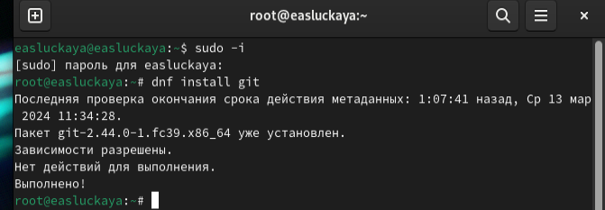{#fig:001 width=100%}

Для установки **gh** так же вводим команду **dnf install**. Дальше соглашаемся с установкой и ждем окончания процесса (рис. [-@fig:002]).

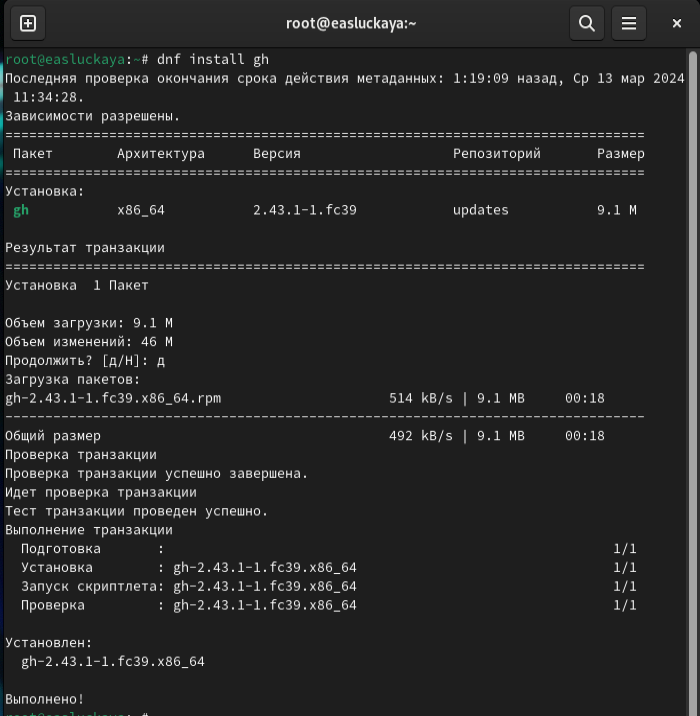{#fig:002 width=100%}

Сделаем базовые настройки git. Для этого зададим имя и почту владельца репозитория (**git config --global user.name "Name Surname"** и **git config --global user.email "work@mail**), настроим utf-8 в выводе сообщений git (**git config --global core.quotepath false**), зададим имя начальной ветки, которую будем называть ее master (**git config --global init.defaultBranch master**) и установим пару параметров (**git config --global core.autocrlf input** и **git config --global core.safecrlf warn**). И проверим изменения с помощью команды **git config --list** (рис. [-@fig:003]).
    
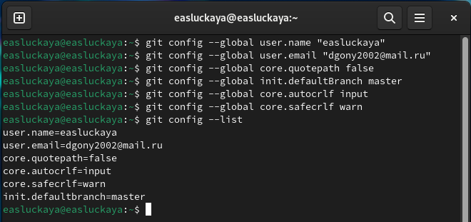{#fig:003 width=100%}

Далее создадим ключ **ssh** по алгоритму rsa с ключом размером 4096 бит с помощью команды **ssh-keygen -t rsa -b 4096** (рис. [-@fig:004]).
    
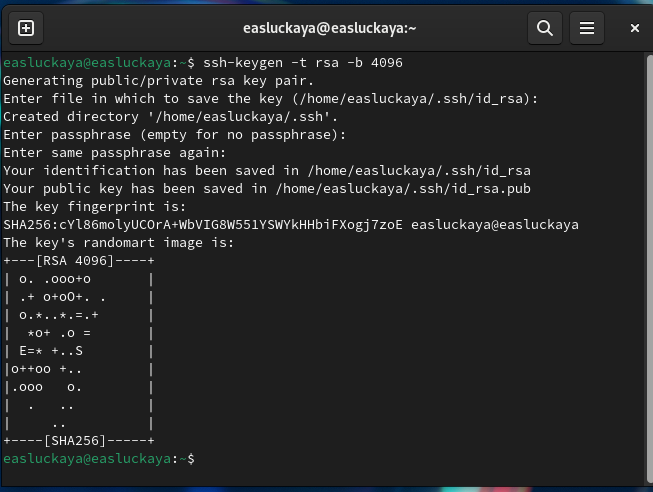{#fig:004 width=100%}

Дальше сгенерируем ключ **pgp** с помощью команды **gpg --full-generate-key**. 

Из предложенных опций выбираем тип RSA и RSA, размер 4096 и срок действия 0 (срок действия не истекает никогда). Так же вводим личную информацию, которая сохранится в ключе, **ГЛАВНОЕ!**, чтобы почта соответствовала адресу, используемому на GitHub  (рис. [-@fig:005]).

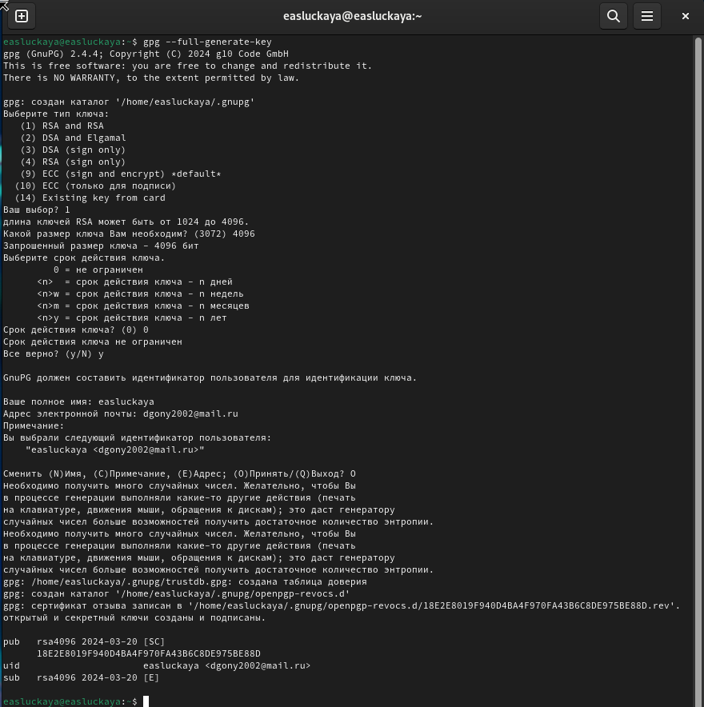{#fig:005 width=100%}

После создадим учетную запись на GitHub, но поскольку у меня уже есть учетка там, то новую делать не буду (рис. [-@fig:006]).
    
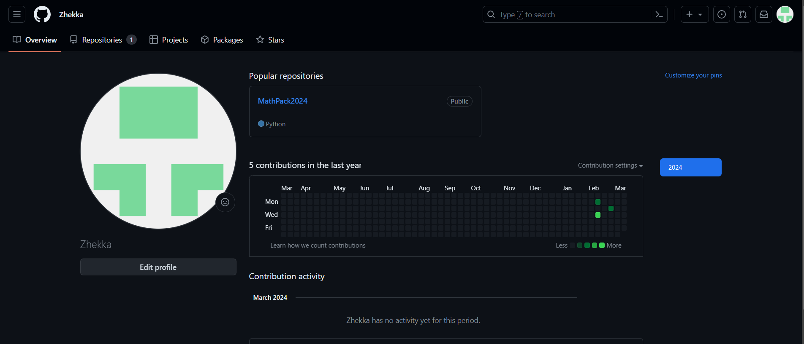{#fig:006 width=100%}

Выводим список ключей и копируем опечаток приватного ключа. Чтобы вывести список используем команду **gpg --list-secret-keys --keyid-format LONG**

Опечаток ключа находится в строке:

**sec   Алгоритм/Отпечаток_ключа Дата_создания [Флаги] [Годен_до]**
        
Копируем его командой **gpg --armor --export <Отпечаток_ключа> | xclip -sel clip** (рис. [-@fig:007]).
    
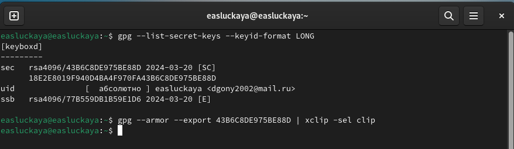{#fig:007 width=100%}

После скопированный ключ добавляем на GitHub (**settings --> SSH and GPG keys --> New GPG key**). Подобным образом добавляем и ssh ключ (рис. [-@fig:008]).
    
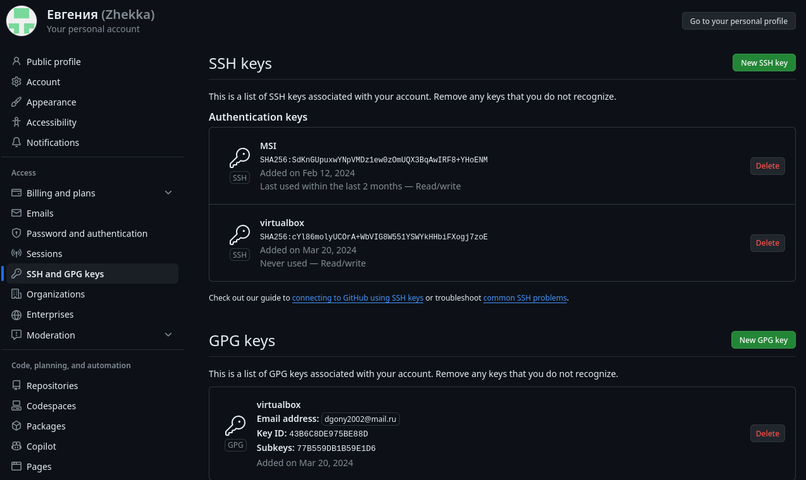{#fig:008 width=100%}

Настроим автоматические подписи коммитов git с помощью команд: **git config --global user.signingkey <Отпечаток_ключа>**, **git config --global commit.gpgsign true**, **git config --global gpg.program $(which gpg2)** (рис. [-@fig:009]).
    
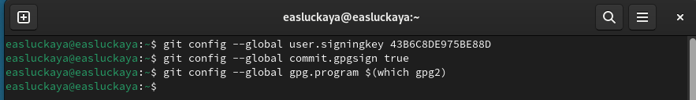{#fig:009 width=100%}

Дальше стоит настроить gh. Для этого вводим команду **gh auth login**. Авторизируемся через браузер, вводим код из терминала и все готово (рис. [-@fig:010]), (рис. [-@fig:011]).
    
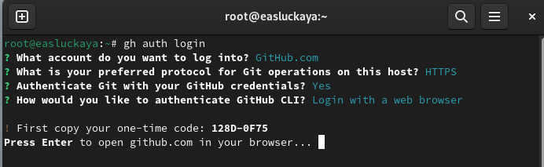{#fig:010 width=100%}

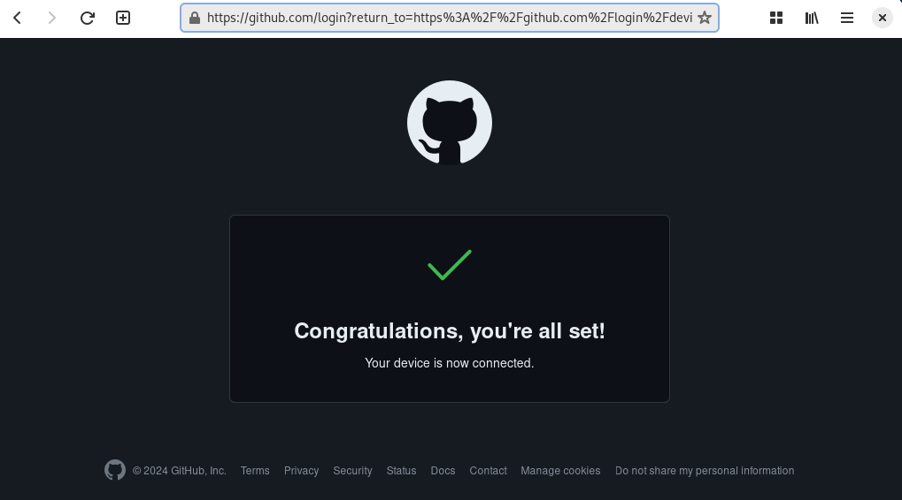{#fig:011 width=100%}

Создадим репозиторий на GitHub. Для 2023–2024 учебного года и предмета «Операционные системы» (код предмета os-intro) создание репозитория примет следующий вид: 

**mkdir -p ~/work/study/2023-2024/"Операционные системы"**

**cd ~/work/study/2023-2024/"Операционные системы"**

**gh repo create study_2023-2024_os-intro --template=yamadharma/course-directory-student-template --public**

**git clone --recursive git@github.com:<owner>/study_2023-2024_os-intro.git os-intro** (рис. [-@fig:012]).
    
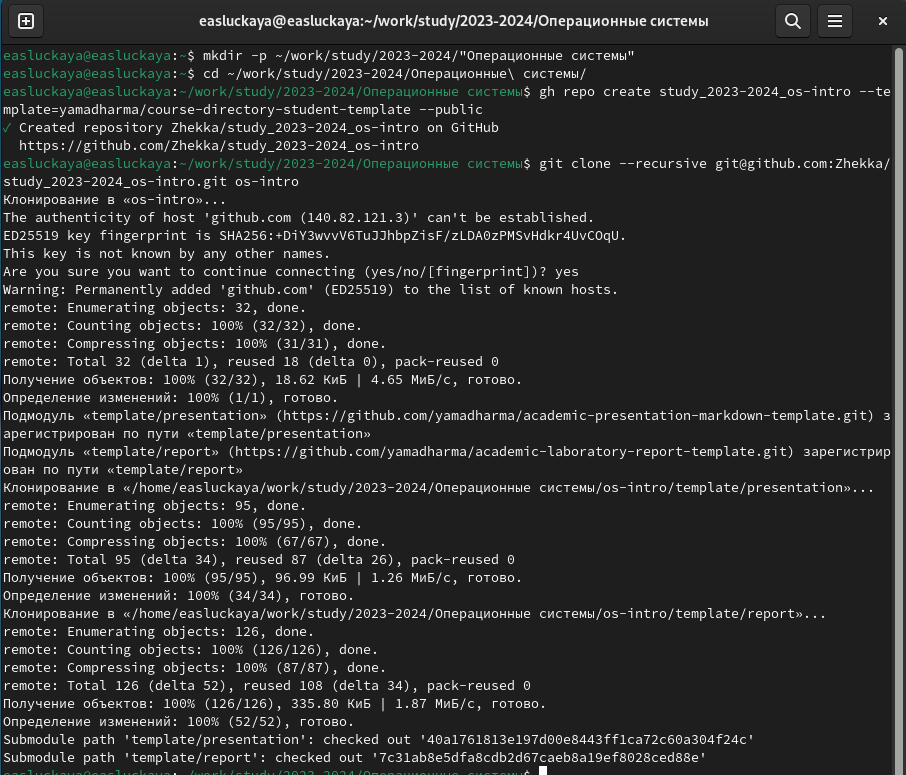{#fig:012 width=100%}

Настроим каталог курса. Для этого сначала перейдем в сам каталог, который склонировали до этого, с помощью команды **cd**, удалим лишние файлы (**rm package.json**), также создадим еще необходимые каталоги (**echo os-intro > COURSE** после **make**), которые после отправим на сервер (**git add .**, **git commit -am 'feat(main): make course structure'**, **git push**) (рис. [-@fig:013]), (рис. [-@fig:014]).

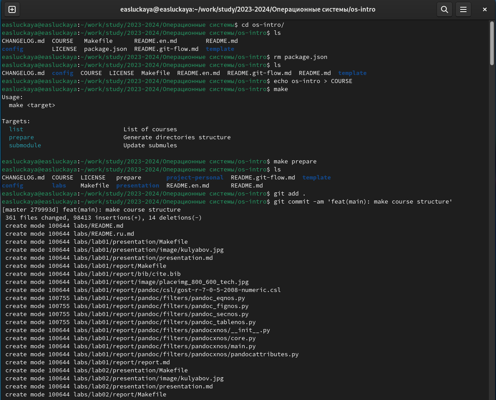{#fig:013 width=100%}

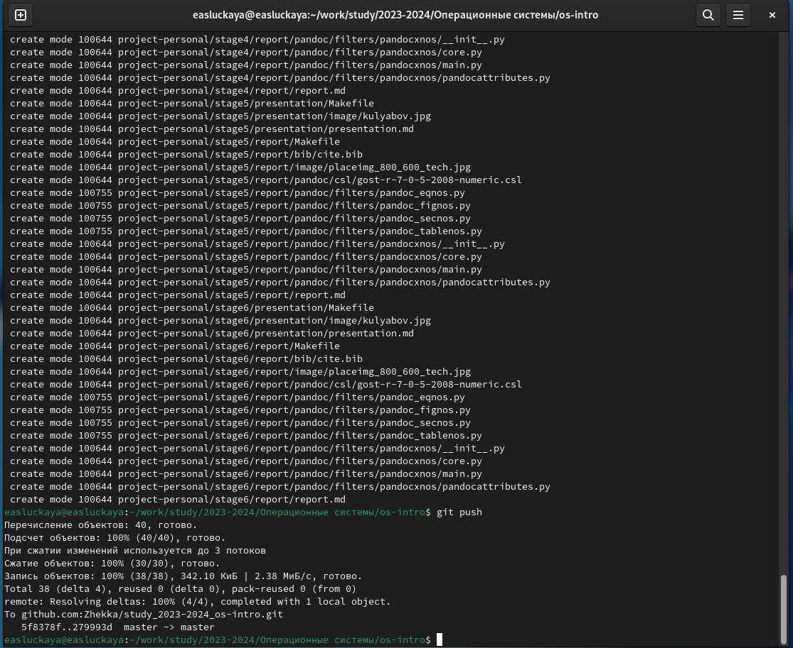{#fig:014 width=100%}

# Контрольные вопросы

1. **Что такое системы контроля версий (VCS) и для решения каких задач они предназначаются?**

Система контроля версий (VCS) — это инструмент, использование которого позволяет отслеживать изменения в файловой системе, фиксировать историю изменений, а также возвращаться к предыдущим версиям файлов. Они предназначены для управления изменениями в проектах программного обеспечения и других файлов, позволяя команде разработчиков совместно работать над кодом, отслеживать изменения, управлять конфликтами и версиями, а также восстанавливать предыдущие состояния проекта.

2. **Объясните следующие понятия VCS и их отношения: хранилище, commit, история, рабочая копия.**

**Хранилище (репозиторий)** — это централизованное место, где хранятся файлы и история изменений проекта. Оно содержит все версии файлов, метаданные и историю коммитов.

**Commit (фиксация)** — это действие по сохранению изменений в системе контроля версий. При коммите разработчик предоставляет описание внесенных изменений, и эти изменения фиксируются в репозитории.

**История (history)** — это список всех коммитов и изменений, связанных с проектом. История содержит информацию о том, кто, когда и какие изменения вносил, и позволяет отслеживать всю историю проекта.

**Рабочая копия (working copy)** — это локальная копия файлов из репозитория, с которой работает разработчик. Рабочая копия содержит текущую версию проекта, и разработчик вносит изменения в нее перед их фиксацией (коммитом) в репозиторий.

3. **Что представляют собой и чем отличаются централизованные и децентрализованные VCS? Приведите примеры VCS каждого вида.**

**Централизованная система контроля версий (Centralized Version Control System, CVS)** предполагает, что существует единый центральный репозиторий, в котором хранится вся история проекта. Разработчики работают с рабочими копиями файлов, которые забирают из центрального репозитория, вносят изменения и отправляют их обратно. Примеры централизованных VCS: CVS, Subversion (SVN), Perforce.

**Децентрализованные системы контроля версий (Distributed Version Control System, DVCS)** отличаются тем, что каждый разработчик имеет свою локальную копию репозитория, содержащую всю историю проекта. Это позволяет работать независимо от доступности центрального сервера и облегчает совместную работу над проектом. Примеры децентрализованных VCS: Git, Mercurial, Bazaar.

Основные отличия между централизованными и децентрализованными системами контроля версий заключаются в том, как управляется и хранится история версий проекта, а также в способе совместной работы разработчиков.

4. **Опишите действия с VCS при единоличной работе с хранилищем.**

При единоличной работе с хранилищем VCS основными действиями будут:

- **Инициализация репозитория**: создание нового проекта или клонирование существующего репозитория из удаленного источника (например, GitHub).

- **Добавление файлов**: добавление новых файлов в репозиторий или изменение уже существующих файлов.

- **Фиксация изменений**: коммит изменений в репозиторий с указанием описания изменений.

- **Просмотр истории изменений**: просмотр и анализ всех предыдущих коммитов, внесенных в репозиторий.

- **Ветвление**: создание отдельных веток для разработки новых функций или исправлений багов.

- **Объединение изменений**: слияние веток и консолидация изменений в основной ветке разработки.

- **Удаление файлов**: удаление ненужных файлов из репозитория.

- **Удаленная работа**: отправка изменений на удаленный сервер и получение изменений из удаленного репозитория.

Все эти действия помогают эффективно управлять версиями кода и отслеживать изменения в проекте, даже при работе в одиночку.

5. **Опишите порядок работы с общим хранилищем VCS.**

- **Создание репозитория**: сначала необходимо создать репозиторий на сервере или в облаке, где будет храниться общее хранилище файлов.

- **Клонирование репозитория**: разработчики должны клонировать репозиторий себе на локальную машину, чтобы иметь доступ к файлам и иметь возможность вносить изменения.

- **Работа с файлами**: разработчики могут вносить изменения в файлы на локальной машине, создавать новые файлы, удалять или редактировать существующие.

- **Подготовка к коммиту**: перед сохранением изменений в репозиторий, необходимо подготовить их к коммиту, добавив их в "индекс" при помощи команды git add.

- **Коммит изменений**: после подготовки изменений, разработчики должны сделать коммит, сохраняя все внесенные изменения в историю репозитория при помощи команды git commit.

- **Пуш изменений**: после коммита, изменения могут быть отправлены в общее хранилище с помощью команды git push, что позволит другим разработчикам видеть и получать эти изменения.

- **Обновление локального репозитория**: разработчики могут получить последние изменения из общего хранилища с помощью команды git pull, чтобы обновить свою локальную версию репозитория.

Таким образом, порядок работы с общим хранилищем VCS заключается в клонировании, внесении изменений, коммите и отправке изменений в общее хранилище, а также в получении и обновлении локальной версии репозитория.

6. **Каковы основные задачи, решаемые инструментальным средством git?**
- Управление версиями файлов и их изменениями

- Совместная разработка проектов

- Отслеживание изменений и истории проекта

- Управление конфликтами при слиянии изменений

- Резервное копирование и восстановление данных

7. **Назовите и дайте краткую характеристику командам git.**

**git init**: инициализация нового репозитория

**git add**: добавление изменений в индекс

**git commit**: сохранение изменений в репозитории

**git push**: отправка изменений в удаленный репозиторий

**git pull**: получение изменений из удаленного репозитория

**git branch**: создание, удаление и просмотр веток

**git merge**: объединение изменений из другой ветки

**git checkout**: переключение между ветками

8. **Приведите примеры использования при работе с локальным и удалённым репозиториями.**

**Локальный репозиторий**: создание нового проекта с помощью git init, добавление новых файлов с помощью git add, сохранение изменений в репозитории с помощью git commit.

**Удаленный репозиторий**: отправка изменений из локального репозитория на удаленный с помощью git push, получение изменений из удаленного репозитория с помощью git pull.

9. **Что такое и зачем могут быть нужны ветви (branches)?**

Ветви (branches) в git используются для разработки новых функций, изоляции изменений, параллельной разработки, исправления ошибок и управления версиями проектов.

10. **Как и зачем можно игнорировать некоторые файлы при commit?**

Для игнорирования некоторых файлов при commit в git используется файл .gitignore, в котором указываются шаблоны файлов или директорий, которые не должны попадать в репозиторий. Например, можно игнорировать временные файлы, файлы с настройками IDE, файлы с конфиденциальной информацией и т.д.

# Выводы

В данной лабораторной работе мы изучили идеологию и применение средств контроля версий, а также освоили умения по работе с git.

# Список литературы{.unnumbered}

1. О системе контроля версий [Электронный ресурс]. 2016. URL: https://git-scm.com/book/ru/v2/Введение-О-системе-контроля-версий.

2. Евгений Г. Системы контроля версий [Электронный ресурс]. 2016. URL: https://glebradchenko.susu.ru/courses/bachelor/engineering/2016/SUSU_SE_2016_REP_3_VCS.pdf.

3. Системы контроля версий [Электронный ресурс]. 2016. URL: http://uii.mpei.ru/study/courses/sdt/16/lecture02.2_vcs.slides.pdf.

::: {#refs}
:::
