---
## Front matter
title: "Отчёта по лабораторной работе №5:"
subtitle: "Анализ файловой системы Linux. Команды для работы с файлами и каталогами"
author: "Слуцкая Евгения Александровна"

## Generic otions
lang: ru-RU
toc-title: "Содержание"

## Bibliography
bibliography: bib/cite.bib
csl: pandoc/csl/gost-r-7-0-5-2008-numeric.csl

## Pdf output format
toc: true # Table of contents
toc-depth: 2
lof: true # List of figures
fontsize: 12pt
linestretch: 1.5
papersize: a4
documentclass: scrreprt
## I18n polyglossia
polyglossia-lang:
  name: russian
  options:
	- spelling=modern
	- babelshorthands=true
polyglossia-otherlangs:
  name: english
## I18n babel
babel-lang: russian
babel-otherlangs: english
## Fonts
mainfont: PT Serif
romanfont: PT Serif
sansfont: PT Sans
monofont: PT Mono
mainfontoptions: Ligatures=TeX
romanfontoptions: Ligatures=TeX
sansfontoptions: Ligatures=TeX,Scale=MatchLowercase
monofontoptions: Scale=MatchLowercase,Scale=0.9
## Biblatex
biblatex: true
biblio-style: "gost-numeric"
biblatexoptions:
  - parentracker=true
  - backend=biber
  - hyperref=auto
  - language=auto
  - autolang=other*
  - citestyle=gost-numeric
## Pandoc-crossref LaTeX customization
figureTitle: "Рис."
tableTitle: "Таблица"
listingTitle: "Листинг"
lofTitle: "Список иллюстраций"
lolTitle: "Листинги"
## Misc options
indent: true
header-includes:
  - \usepackage{indentfirst}
  - \usepackage{float} # keep figures where there are in the text
  - \floatplacement{figure}{H} # keep figures where there are in the text
---

# Цель работы

Ознакомление с файловой системой Linux, её структурой, именами и содержанием каталогов. Приобретение практических навыков по применению команд для работы с файлами и каталогами, по управлению процессами (и работами), по проверке использования диска и обслуживанию файловой системы.

# Задание

1. Выполните все примеры, приведённые в первой части описания лабораторной работы.

2. Выполните следующие действия, зафиксировав в отчёте по лабораторной работе используемые при этом команды и результаты их выполнения:

- Скопируйте файл /usr/include/sys/io.h в домашний каталог и назовите его equipment. Если файла io.h нет, то используйте любой другой файл в каталоге /usr/include/sys/ вместо него.

- В домашнем каталоге создайте директорию ~/ski.plases.

- Переместите файл equipment в каталог ~/ski.plases.

- Переименуйте файл ~/ski.plases/equipment в ~/ski.plases/equiplist.

- Создайте в домашнем каталоге файл abc1 и скопируйте его в каталог ~/ski.plases, назовите его equiplist2.

- Создайте каталог с именем equipment в каталоге ~/ski.plases.

- Переместите файлы ~/ski.plases/equiplist и equiplist2 в каталог ~/ski.plases/equipment.

- Создайте и переместите каталог ~/newdir в каталог ~/ski.plases и назовите его plans.

3. Определите опции команды chmod, необходимые для того, чтобы присвоить перечисленным ниже файлам выделенные права доступа, считая, что в начале таких прав нет:

- drwxr--r-- ... australia

- drwx--x--x ... play

- -r-xr--r-- ... my_os

- -rw-rw-r-- ... feathers

При необходимости создайте нужные файлы.

4. Проделайте приведённые ниже упражнения, записывая в отчёт по лабораторной работе используемые при этом команды:

- Просмотрите содержимое файла /etc/password.

- Скопируйте файл ~/feathers в файл ~/file.old.

- Переместите файл ~/file.old в каталог ~/play.

- Скопируйте каталог ~/play в каталог ~/fun.

- Переместите каталог ~/fun в каталог ~/play и назовите его games.

- Лишите владельца файла ~/feathers права на чтение.

- Что произойдёт, если вы попытаетесь просмотреть файл ~/feathers командой cat?

- Что произойдёт, если вы попытаетесь скопировать файл ~/feathers?

- Дайте владельцу файла ~/feathers право на чтение.

- Лишите владельца каталога ~/play права на выполнение.

- Перейдите в каталог ~/play. Что произошло?

- Дайте владельцу каталога ~/play право на выполнение.

5. Прочитайте man по командам mount, fsck, mkfs, kill и кратко их охарактеризуйте, приведя примеры.

# Теоретическое введение

Приведём основные команды Unix, которые мы будем использовать в процессе выполнения лабораторной работы №4.

В табл. @tbl:std-dir приведен краткий справочник по командам терминала Unix-систем.

: Краткий справочник по командам терминала GNU Linux {#tbl:std-dir}

| Имя команды | Описание команды                                                                                                         |
|--------------|----------------------------------------------------------------------------------------------------------------------------|
| `touch имя_файла`          |    Создание файла                                                  |
| `cat имя_файла`      | Просмотр содержимого файлов небольшого размера     |
| `less имя_файла`       |    Просмотр файла постранично                                        |
| `head [-n] имя_файла`      | Вывод по умолчанию 10 первых строк файла или n строк |
| `tail [-n] имя_файла`    | Вывод последних n строк файла |                                                                                  |
| `cp исходная_директория целевая_директория`      | Копирование файлов  и каталогов                                                                                    |
| `mkdir имя_директории`       | Создание директории                |
| `mv старый_файл новый_файл`       | Перемещение (переименование) каталогов                                                                               |     |

# Выполнение лабораторной работы

1. Выполним все примеры, приведённые в первой части описания лабораторной работы. 

Для копирования файлов и каталогов будем использовать команду `cp [-опции] исходный_файл целевой_файл`, а для их перемещения и переименования будем использовать команду `mv [-опции] старый_файл новый_файл`:

**Копирование файла в текущем каталоге** - скопировать файл ~/abc1 в файл april и в файл may (рис. [-@fig:001]).

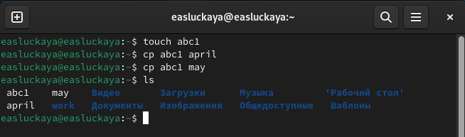{#fig:001 width=100%}

**Копирование нескольких файлов в каталог** - скопировать файлы april и may в каталог monthly (рис. [-@fig:002]).

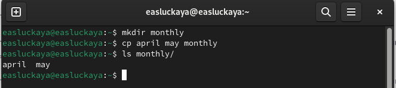{#fig:002 width=100%}

**Копирование файлов в произвольном каталоге** - скопировать файл monthly/may в файл с именем june (рис. [-@fig:003]).
    
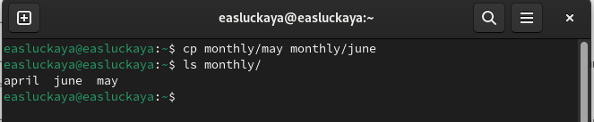{#fig:003 width=100%}

**Копирование каталогов в текущем и произвольном каталогах** - скопировать каталог monthly в каталог monthly.00, скопировать каталог monthly.00 в каталог /tmp (рис. [-@fig:004]).
    
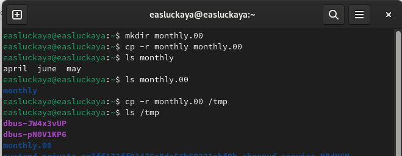{#fig:004 width=100%}

**Переименование файлов в текущем каталоге** - изменить название файла april на july в домашнем каталоге. **Перемещение файлов в другой каталог** - переместить файл july в каталог monthly.00(рис. [-@fig:005]).

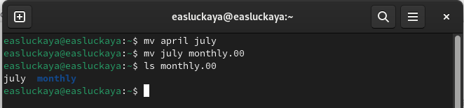{#fig:005 width=100%}

**Переименование каталогов в текущем каталоге** - переименовать каталог monthly.00 в monthly.01. **Перемещение каталога в другой каталог** - переместить каталог monthly.01 в каталог reports. **Переименование каталога, не являющегося текущим** - переименовать каталог reports/monthly.01 в reports/monthly (рис. [-@fig:006]).
    
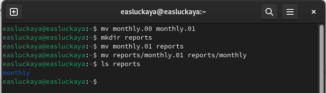{#fig:006 width=100%}

Создадим файл ~/may с правом выполнения для владельца, а затем лишим владельца прав на выполнение (рис. [-@fig:007]).
    
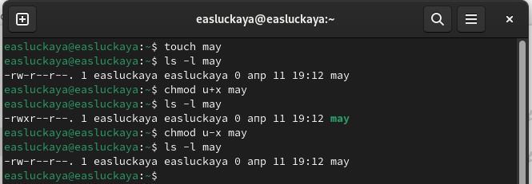{#fig:007 width=100%}

2. Скопируем файл /usr/include/sys/io.h в домашний каталог и назовем его equipment. Если файла io.h нет, то используем любой другой файл в каталоге /usr/include/sys/ вместо него (рис. [-@fig:008]).
    
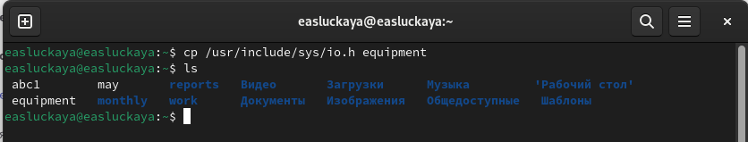{#fig:008 width=100%}

В домашнем каталоге создадим директорию ~/ski.plases и переместим файл equipment в новый каталог. После переименуем файл equiplist(рис. [-@fig:009]).
    
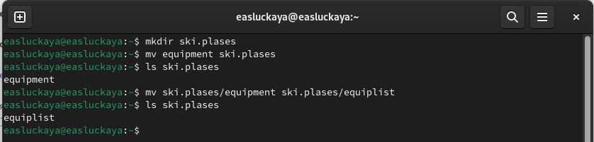{#fig:009 width=100%}

Создадим в домашнем каталоге файл abc1 и скопируем его в каталог ~/ski.plases и назовем его equiplist2 (рис. [-@fig:010]).
    
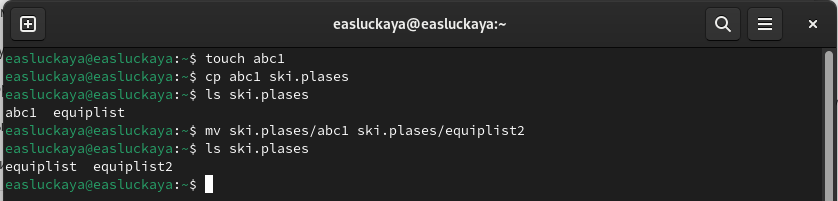{#fig:010 width=100%}

Создадим каталог с именем equipment в каталоге ~/ski.plases. Затем переместим файлы ~/ski.plases/equiplist и equiplist2 в каталог ~/ski.plases/equipment (рис. [-@fig:011]).

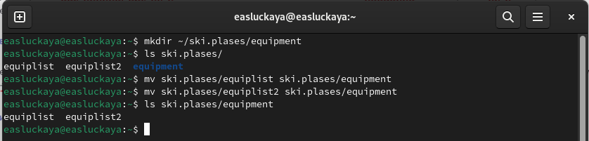{#fig:011 width=100%}

Создадим и переместим каталог ~/newdir в каталог ~/ski.plases и назовем его plans. (рис. [-@fig:012]).
    
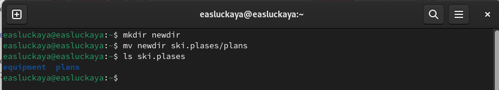{#fig:012 width=100%}

3. Определим опции команды **chmod**, необходимые для того, чтобы присвоить перечисленным ниже файлам выделенные права доступа, считая, что в начале таких прав нет:
- **drwxr--r-- ... australia**: создадим новый каталог australia, проверим какие у него права, а после, в моем случае, используем `chmod g-x,o-x australia`, чтобы изменить на нужные права (рис. [-@fig:013]).

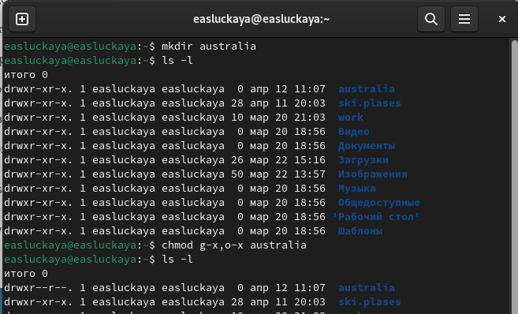{#fig:013 width=100%}

- **drwx--x--x ... play**: делаем то же самое, но используем `chmod g-r,o-r play` (рис. [-@fig:014]).

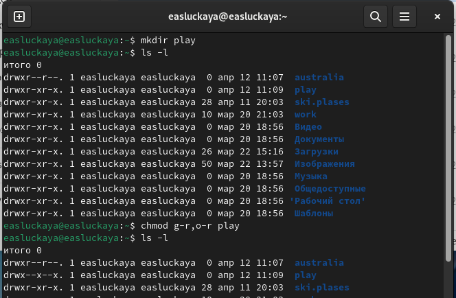{#fig:014 width=100%}

- **-r-xr--r-- ... my_os**: создаем в этот раз уже файл my_os и пишем команду `chmod u-w,u+x my-os` (рис. [-@fig:015]).

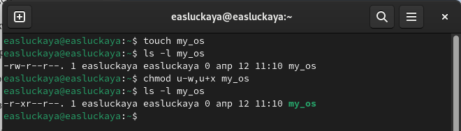{#fig:015 width=100%}

- **-rw-rw-r-- ... feathers**: здесь уже используем `chmod g+w feathers` (рис. [-@fig:016]).

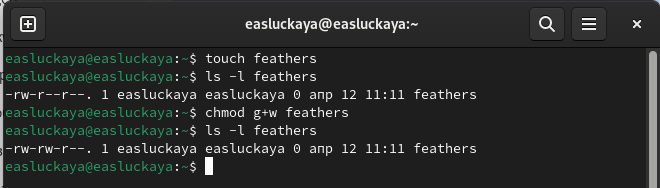{#fig:016 width=100%}

4. Просмотрим содержимое файла /etc/passwd, используя команду **cat** (рис. [-@fig:017]).

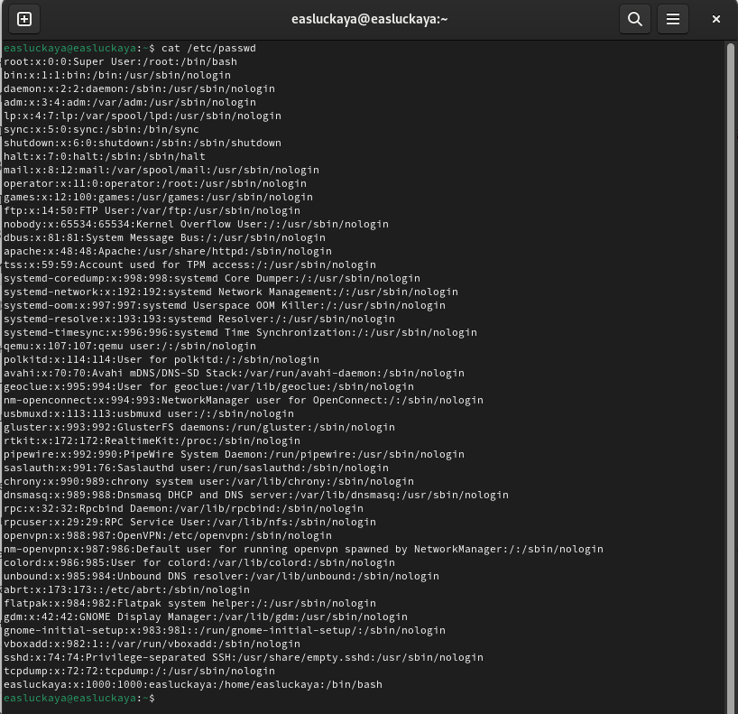{#fig:017 width=100%}

Скопируем файл ~/feathers в файл ~/file.old, а затем переместим файл ~/file.old в каталог ~/play (рис. [-@fig:018]).

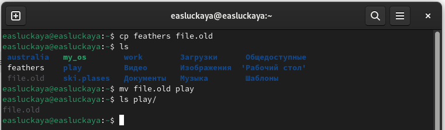{#fig:018 width=100%}

Скопируем каталог ~/play в каталог ~/fun.После переместим каталог ~/fun в каталог ~/play и назовите его games(рис. [-@fig:019]).

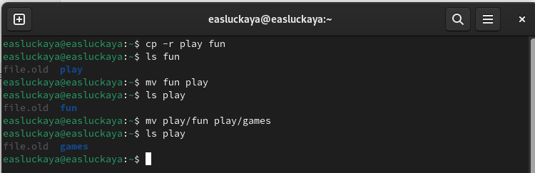{#fig:019 width=100%}

Лишим владельца файла ~/feathers права на чтение, используя команду `chmod u-r feathers`. Если мы попробуем просмотреть файл ~/feathers командой cat, то нам будет отказано в доступе, то же самое произойдет, если захотим скопировать данный файл. После вернем все обратно командой `chmod u+r feathers` (рис. [-@fig:020]).

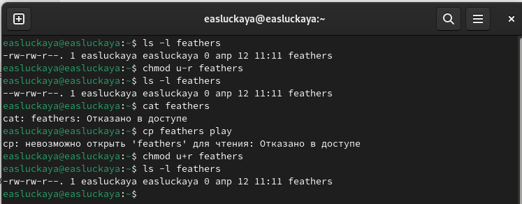{#fig:020 width=100%}

Лишим теперь владельца каталога ~/play права на выполнение, командой `chmod u-x play`. Попробуем перейти в каталог ~/play, то нам будет отказано в доступе. Вернем владельцу каталога ~/play право на выполнение, командой `chmod u+x play` (рис. [-@fig:021]).

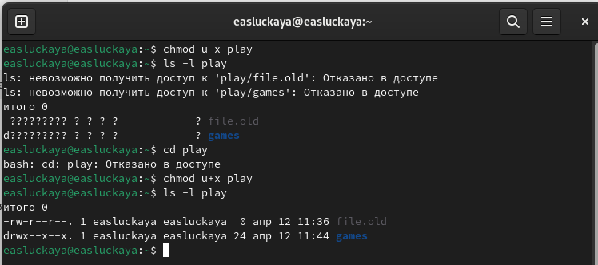{#fig:021 width=100%}

Прочитаем man по командам mount, fsck, mkfs, kill:

- **mount**: команда mount используется для подключения файловых систем к каталогу в иерархии файловой системы (рис. [-@fig:022]).

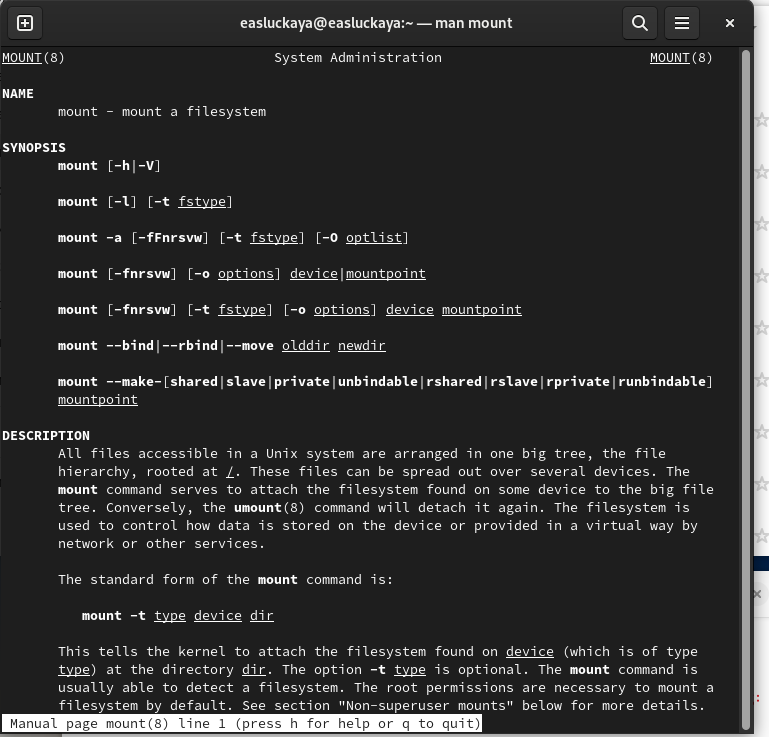{#fig:022 width=100%}

- **fsck**: команда fsck (file system check) предназначена для проверки и исправления целостности файловых систем (рис. [-@fig:023]).

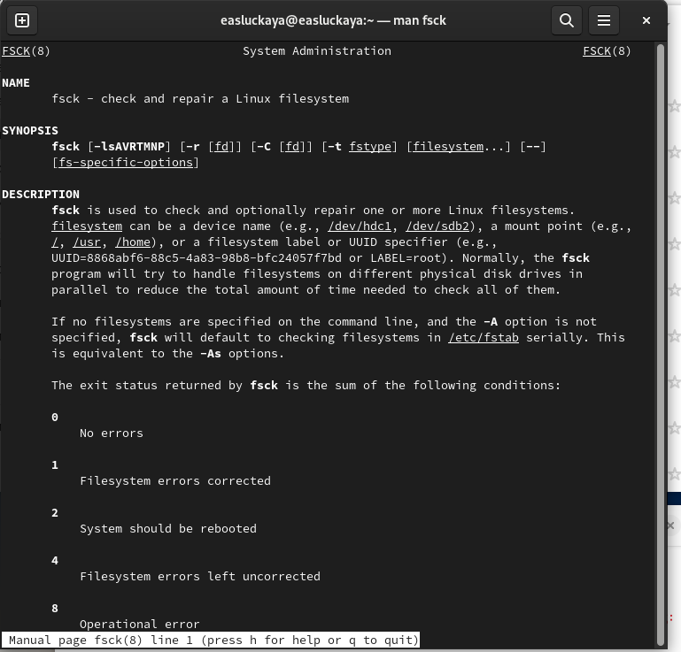{#fig:023 width=100%}

- **mkfs**: команда mkfs (make file system) используется для создания новой файловой системы на указанном устройстве (рис. [-@fig:024]).

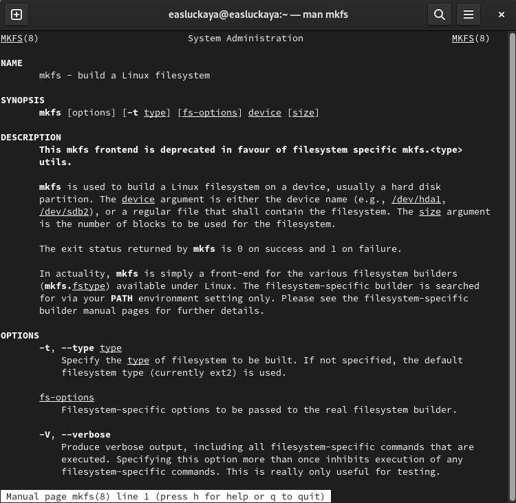{#fig:024 width=100%}

- **kill**: команда kill используется для отправки сигнала процессу или группе процессов, что может привести к их завершению (рис. [-@fig:025]).

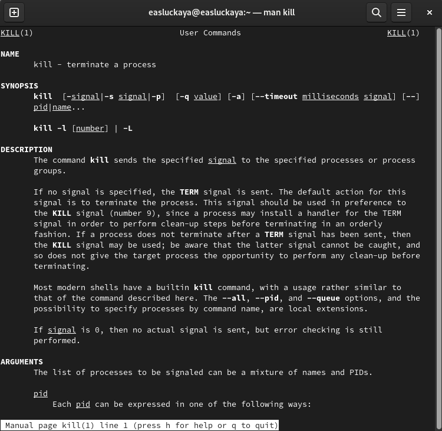{#fig:025 width=100%}

# Контрольные вопросы

1. **Приведите общую структуру файловой системы и дайте характеристику каждой директории первого уровня этой структуры.**

Общая структура файловой системы в большинстве операционных систем может быть представлена следующим образом:

**/** - корневая директория

**/bin** - содержит основные исполняемые файлы, необходимые для загрузки и базовых операций в системе.

**/boot** - содержит файлы, необходимые для загрузки операционной системы.

**/dev** - содержит файлы, представляющие устройства в системе.

**/etc** - содержит конфигурационные файлы для системы и установленных программ.

**/home** - директории пользователей.

**/lib** - содержит библиотеки, необходимые для запуска исполняемых файлов в /bin и /sbin.

**/media** - место для монтирования временных носителей, таких как USB-накопители.

**/mnt** - место для временного монтирования файловых систем.

**/opt** - используется для установки "дополнительных" программ.

**/proc** - виртуальная файловая система, предоставляющая информацию о процессах в системе.

**/root** - домашняя директория суперпользователя (root).

**/run** - временная файловая система, хранящая данные, специфичные для текущего запуска системы.

**/sbin** - содержит основные системные исполняемые файлы.

**/srv** - содержит данные, используемые локальными сервисами.

**/sys** - виртуальная файловая система, предоставляющая информацию о ядре Linux.

**/tmp** - временная директория, доступная всем пользователям для временных файлов.

**/usr** - вторичная иерархия, содержащая все несистемные программы и данные.

**/var** - содержит изменяемые файлы, такие как журналы, временные файлы и кэши.

Каждая из этих директорий первого уровня имеет свою уникальную роль в файловой системе операционной системы.

2. **Какая операция должна быть выполнена, чтобы содержимое некоторой файловой системы было доступно операционной системе?**

Чтобы содержимое некоторой файловой системы стало доступным операционной системе, необходимо выполнить операцию монтирования (**mount**). Монтирование - это процесс подключения файловой системы к определенной точке в иерархии файловой системы операционной системы. Это позволяет операционной системе видеть и обращаться к содержимому этой файловой системы.

3. **Назовите основные причины нарушения целостности файловой системы. Как устранить повреждения файловой системы?**

Основные причины нарушения целостности файловой системы включают:

- **Сбои в питании**: Внезапное отключение питания может привести к повреждению файлов, так как операции записи могут быть прерваны, что приводит к неправильному состоянию файловой системы.

- **Сбои в работе жёсткого диска или других устройств хранения данных**: Неисправности жестких дисков или других устройств хранения данных могут вызвать повреждение файлов и структуры файловой системы.

- **Вирусы и вредоносное ПО**: Атаки вирусов и вредоносного программного обеспечения могут изменять или удалять файлы, что приводит к нарушению целостности файловой системы.

- **Неправильное завершение работы программ или операционной системы**: Если программа или операционная система завершается некорректно, это может привести к повреждению файлов и структуры файловой системы.

- **Физические повреждения устройств хранения данных**: Механические повреждения жестких дисков или других устройств хранения данных могут привести к потере данных и повреждению файловой системы.

Для устранения повреждений файловой системы можно предпринять следующие шаги:

- **Проверка и восстановление файловой системы**: Использование специальных инструментов, таких как fsck в Linux, для проверки и восстановления целостности файловой системы.

- **Использование резервных копий**: Восстановление поврежденных файлов из резервных копий, если они доступны.

- **Использование специализированных программ**: Использование специализированных программ для восстановления данных с поврежденных устройств хранения.

- **Замена неисправных устройств хранения данных**: В случае физических повреждений устройств хранения данных требуется их замена и восстановление данных из резервных копий, если таковые имеются.

- **Установка антивирусного ПО и обновление системы**: Защита от вирусов и вредоносного ПО путем установки антивирусного программного обеспечения и регулярное обновление операционной системы для устранения уязвимостей.

Кроме того, важно регулярно создавать резервные копии данных, чтобы в случае повреждения файловой системы можно было восстановить данные из последней рабочей копии.

4. **Как создаётся файловая система?**

- **Использовать команду mkfs**: В большинстве дистрибутивов Linux для создания файловой системы используется команда mkfs, например, для создания ext4-файловой системы: `mkfs.ext4 /dev/sdX`.

- **Настройка параметров файловой системы**: Вы можете указать различные параметры, такие как размер блока, метку тома и другие опции в зависимости от вашего выбора файловой системы.

- **Монтирование файловой системы (опционально)**: После создания файловой системы вы можете выполнить операцию монтирования, чтобы сделать её доступной для использования операционной системой.

5. **Дайте характеристику командам для просмотра текстовых файлов.**

Команды для просмотра текстовых файлов предоставляют пользователю возможность просматривать содержимое текстовых файлов непосредственно в терминале или командной строке. Вот несколько основных команд для просмотра текстовых файлов:

- **cat**: Команда `cat` (concatenate) используется для отображения содержимого одного или нескольких файлов в терминале. Она также может использоваться для объединения нескольких файлов и вывода содержимого на экран.

- **less**: Команда `less` позволяет просматривать содержимое файла постранично. Это удобно для просмотра больших файлов, так как позволяет легко прокручивать вперед и назад, а также искать в тексте.

- **more**: Подобно команде `less`, команда `more` также используется для просмотра содержимого файла постранично. Однако `more` менее гибкая по сравнению с `less`.

- **head**: Команда `head` выводит начальные строки текстового файла. По умолчанию выводится 10 первых строк файла, но это количество можно изменить с помощью параметра.

- **tail**: Команда `tail` выводит конечные строки текстового файла. По умолчанию выводится 10 последних строк файла, но это количество также можно изменить с помощью параметра.

6. **Приведите основные возможности команды cp в Linux.**

Команда `cp` в Linux предназначена для копирования файлов и каталогов. Она имеет ряд опций, позволяющих выполнять различные операции с копированием. Вот основные возможности команды `cp`:

- **Копирование файлов**: С помощью `cp` можно скопировать один или несколько файлов из одного места в другое. Например: `cp file1.txt /путь/к/директории`.

- **Копирование каталогов**: Команда `cp` также позволяет копировать целые каталоги со всем их содержимым. Для этого используется опция `-r` (рекурсивное копирование).

- **Подтверждение при копировании**: При копировании файлов в уже существующий каталог с тем же именем, команда `cp` запрашивает подтверждение, если вы не используете опцию перезаписи.

- **Переименование файлов**: Можно использовать команду `cp` для переименования файлов, скопировав файл с новым именем. Например: `cp file1.txt newfile.txt`.

- **Сохранение атрибутов файлов**: Опции `cp` позволяют сохранить атрибуты файлов, такие как права доступа, временные метки и владельца файла.

- **Рекурсивное копирование**: С помощью опции `-r` или `-R` можно скопировать каталог и всё его содержимое, включая подкаталоги.

- **Создание резервной копии**: Команда `cp` может быть использована для создания резервных копий файлов и каталогов.

- **Копирование множества файлов в один каталог**: Можно одновременно скопировать несколько файлов в один каталог, указав последним аргументом имя каталога.

7. **Приведите основные возможности команды mv в Linux.**

Команда `mv` в Linux используется для перемещения файлов и каталогов. Она также может быть использована для переименования файлов и каталогов. Вот основные возможности команды `mv`:

- **Перемещение файлов**: Команда `mv` позволяет переместить один или несколько файлов из одной директории в другую. Например: `mv file1.txt /путь/к/другой_директории`.

- **Перемещение каталогов**: Аналогично файлам, команда `mv` может перемещать целые каталоги со всем их содержимым.

- **Переименование файлов**: Путем использования `mv` можно также переименовывать файлы, перемещая файл с новым именем. Например: `mv oldname.txt newname.txt`.

- **Перезапись файлов**: Если файл с указанным именем уже существует в целевой директории, команда `mv` перезапишет его без предупреждения.

- **Сохранение атрибутов файлов**: При перемещении файлов команда `mv` сохраняет атрибуты файлов, такие как права доступа, временные метки и владельца файла.

- **Перемещение и переименование**: Команда `mv` может одновременно перемещать файлы и переименовывать их, предоставляя гибкость в управлении файлами и директориями.

- **Безопасное перемещение множества файлов в один каталог**: Можно одновременно переместить несколько файлов в один каталог, указав последним аргументом имя каталога.

- **Перемещение с подтверждением**: При перемещении файлов в уже существующий каталог с тем же именем, команда `mv` запрашивает подтверждение, если вы не используете опцию перезаписи.

8. **Что такое права доступа? Как они могут быть изменены?**

Права доступа определяют, какие действия могут выполнять пользователи и программы в отношении файлов и каталогов. В системах Unix-подобных операционных системах (таких как Linux), каждый файл и каталог имеет набор прав доступа, который определяет, кто может читать, записывать или выполнять файл, а также кто может изменять его.

Вот основные типы прав доступа:

- **Чтение (Read)**: Пользователь или программа может просматривать содержимое файла или каталога.

- **Запись (Write)**: Пользователь или программа может изменять файл или каталог, добавлять или удалять содержимое.

- **Выполнение (Execute)**: Для каталогов это позволяет входить в каталог и выполнять команды внутри него. Для файлов это позволяет запускать исполняемые файлы.

Права доступа могут быть изменены с помощью команды `chmod` в терминале Linux. Вот основные способы изменения прав доступа:

- **Использование символьной нотации**: Например, `chmod u+r file.txt` добавляет право чтения для владельца файла.

- **Использование числовой нотации**: Назначение прав осуществляется через числовые значения, такие как 755, где каждая цифра представляет набор прав для владельца, группы и других пользователей соответственно.

- **Изменение прав доступа по битам**: Используя флаги `u`, `g`, `o` и комбинации `+` и `-` можно добавлять или удалять права доступа.

# Выводы

В данной лабораторной работе мы ознакомились с файловой системой Linux, её структурой, именами и содержанием каталогов, а также приобрели практические навыки по применению команд для работы с файлами и каталогами, по управлению процессами (и работами), по проверке использования диска и обслуживанию файловой системы.

# Список литературы{.unnumbered}

1. Руководство к лабораторной работе №4.

::: {#refs}
:::
