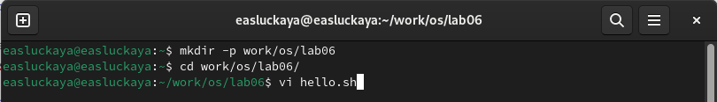
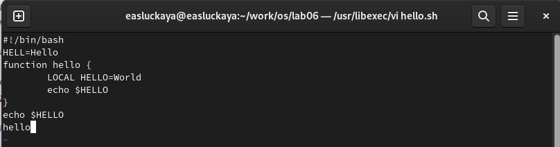
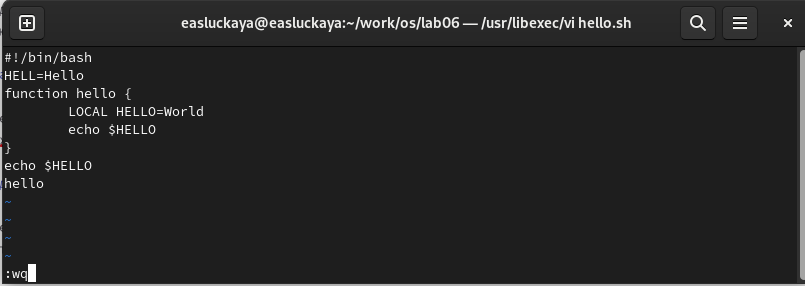
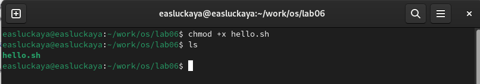
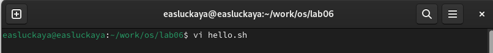
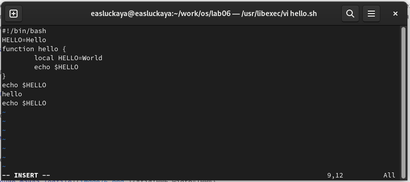
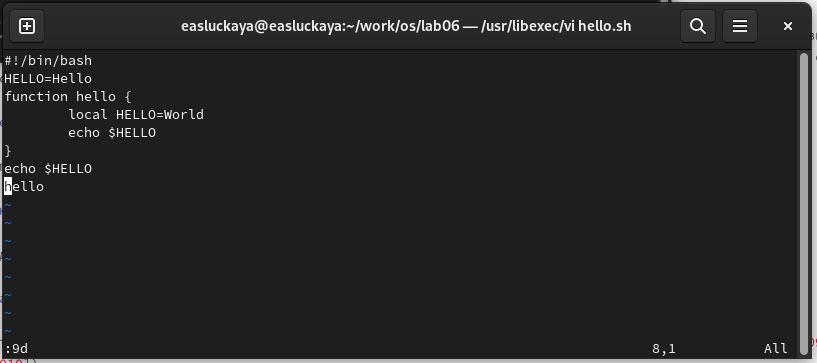
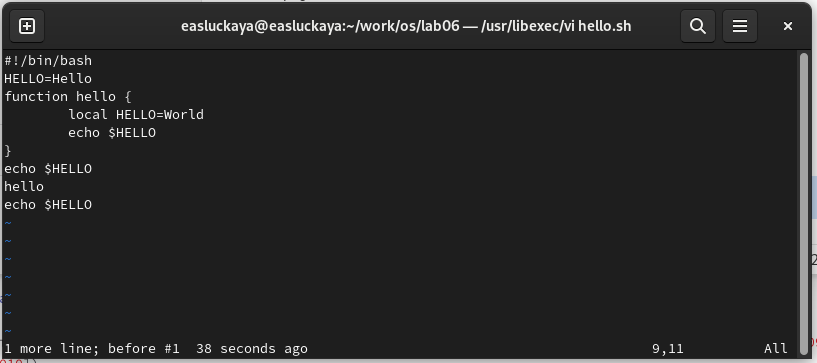
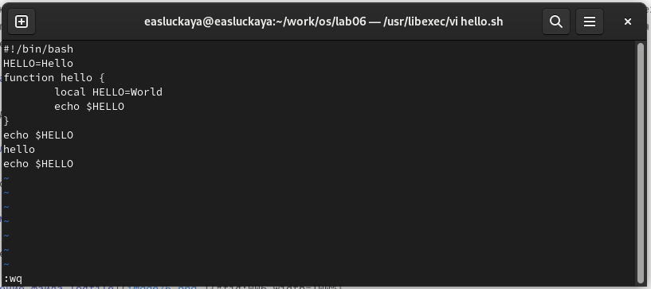

---
## Front matter
title: "Отчёта по лабораторной работе №8:"
subtitle: "Текстовой редактор vi"
author: "Слуцкая Евгения Александровна"

## Generic otions
lang: ru-RU
toc-title: "Содержание"

## Bibliography
bibliography: bib/cite.bib
csl: pandoc/csl/gost-r-7-0-5-2008-numeric.csl

## Pdf output format
toc: true # Table of contents
toc-depth: 2
lof: true # List of figures
fontsize: 12pt
linestretch: 1.5
papersize: a4
documentclass: scrreprt
## I18n polyglossia
polyglossia-lang:
  name: russian
  options:
	- spelling=modern
	- babelshorthands=true
polyglossia-otherlangs:
  name: english
## I18n babel
babel-lang: russian
babel-otherlangs: english
## Fonts
mainfont: PT Serif
romanfont: PT Serif
sansfont: PT Sans
monofont: PT Mono
mainfontoptions: Ligatures=TeX
romanfontoptions: Ligatures=TeX
sansfontoptions: Ligatures=TeX,Scale=MatchLowercase
monofontoptions: Scale=MatchLowercase,Scale=0.9
## Biblatex
biblatex: true
biblio-style: "gost-numeric"
biblatexoptions:
  - parentracker=true
  - backend=biber
  - hyperref=auto
  - language=auto
  - autolang=other*
  - citestyle=gost-numeric
## Pandoc-crossref LaTeX customization
figureTitle: "Рис."
tableTitle: "Таблица"
listingTitle: "Листинг"
lofTitle: "Список иллюстраций"
lolTitle: "Листинги"
## Misc options
indent: true
header-includes:
  - \usepackage{indentfirst}
  - \usepackage{float} # keep figures where there are in the text
  - \floatplacement{figure}{H} # keep figures where there are in the text
---

# Цель работы

Познакомиться с операционной системой Linux. Получить практические навыки работы с редактором vi, установленным по умолчанию практически во всех дистрибутивах.

# Задание

1. Создать новый файл с использованием vi.

2. Редактировать существующий файл.


# Теоретическое введение

В большинстве дистрибутивов Linux в качестве текстового редактора по умолчанию устанавливается интерактивный экранный редактор vi (*Visual display editor*).

Редактор vi имеет три режима работы:

- командный режим — предназначен для ввода команд редактирования и навигации по редактируемому файлу;
- режим вставки — предназначен для ввода содержания редактируемого файла;
- режим последней (или командной) строки — используется для записи изменений в файл и выхода из редактора.

Для вызова редактора vi необходимо указать команду vi и имя редактируемого файла:

```
vi <имя_файла>
```

При этом в случае отсутствия файла с указанным именем будет создан такой файл. Переход в командный режим осуществляется нажатием клавиши Esc . Для выхода из редактора vi необходимо перейти в режим последней строки: находясь в командном режиме, нажать Shift-; (по сути символ : — двоеточие), затем:

- набрать символы wq, если перед выходом из редактора требуется записать изменения в файл;
- набрать символ q (или q!), если требуется выйти из редактора без сохранения.

**Замечание**. Следует помнить, что vi различает прописные и строчные буквы при наборе (восприятии) команд.

# Выполнение лабораторной работы

1. Создадим новый каталог с именем ~/work/os/lab06 командой `mkdir -p /work/os/lab06`, а после перейдем в него с помощью `cd `. Также вызовем vi и создадим файл hello.sh командой `vi hello.sh` (рис. [-@fig:001]).

{#fig:001 width=100%}

Нажимаю клавишу `i`и ввожу данный текст (рис. [-@fig:002]).

{#fig:002 width=100%}

Нажимаю клавишу `Esc` для перехода в командный режим после завершения ввода текста, затем нажимаю : для перехода в режим последней строки, нажимаю `w` (записать) и `q` (выйти), а затем нажимаю клавишу `Enter` для сохранения текста и завершения работы (рис. [-@fig:003]).
    
{#fig:003 width=100%}

После делаем файл исполняемым с помощью команды `chmod +x hello.sh` (рис. [-@fig:004]).
    
{#fig:004 width=100%}

2. Вызовем vi на редактирование файла. Для этого используем команду `vi hello.sh` (рис. [-@fig:005]).

{#fig:005 width=100%}

Установим курсор в конец слова HELL второй строки и, перейдя в режим вставки, заменим на HELLO. После установим курсор на четвертую строку и сотрем слово LOCAL, а вместо него в режиме вставки введем local. Также после последней строки файла вставим  echo $HELLO (рис. [-@fig:006]).
    
{#fig:006 width=100%}

Удалим последнюю строчку в файле, нажав на `:` и введя `9d`(рис. [-@fig:007]).
    
{#fig:007 width=100%}

В командном режиме нажмем на клавишу `u`, чтобы отменить последнее действие (рис. [-@fig:008]).
    
{#fig:008 width=100%}

Введя `:wq`, запишем произведенные изменения и выйдем из vi (рис. [-@fig:009]).
    
{#fig:009 width=100%}

# Контрольные вопросы

1. **Дайте краткую характеристику режимам работы редактора vi.**

Редактор vi имеет три режима работы:

- **командный режим** — предназначен для ввода команд редактирования и навигации по редактируемому файлу;
- **режим вставки** — предназначен для ввода содержания редактируемого файла;
- **режим последней (или командной) строки** — используется для записи изменений в файл и выхода из редактора

2. **Как выйти из редактора, не сохраняя произведённые изменения?**

Чтобы выйти из редактора vi, не сохраняя изменения, нужно находясь в режиме команд нажать `:q!` и затем клавишу Enter.

3. **Назовите и дайте краткую характеристику командам позиционирования.**

Команды позиционирования включают:

- `h`: Сдвигает курсор влево.
- `j`: Сдвигает курсор вниз.
- `k`: Сдвигает курсор вверх.
- `l`: Сдвигает курсор вправо.
- `0` (ноль): Перемещает курсор в начало строки.
- `$`: Перемещает курсор в конец строки.

4. **Что для редактора vi является словом?**

Для редактора vi слово - это последовательность символов, разделенных пробелами или другими символами пробелов.

5. **Каким образом из любого места редактируемого файла перейти в начало (конец) файла?**

Для перемещения в начало файла используется комбинация клавиш `gg`, а для перемещения в конец файла - комбинация клавиш `G`.

6. **Назовите и дайте краткую характеристику основным группам команд редактирования.**

Основные группы команд редактирования в vi включают:

- **Команды удаления**: Позволяют удалять символы, слова, строки и т. д. Например, `x` удаляет символ под курсором, `dw` удаляет слово и так далее.
- **Команды вставки и изменения текста**: Позволяют вставлять новый текст или изменять существующий. Например, `i` входит в режим вставки перед текущим символом, `a` входит в режим вставки после текущего символа, `c` удаляет текст и входит в режим вставки.
- **Команды копирования и вставки**: Позволяют копировать и вставлять текст. Например, `yy` копирует текущую строку, `p` вставляет содержимое буфера обмена.
- **Команды поиска и замены**: Позволяют находить и заменять текст в файле. Например, `/` начинает поиск вперед, `:%s/old/new/g` заменяет все вхождения "old" на "new" в файле.

7. **Необходимо заполнить строку символами $. Каковы ваши действия?**

Чтобы заполнить строку символами `$`, можно войти в режим вставки (нажав клавишу `i`), набрать символ `$` нужное количество раз и затем выйти из режима вставки (нажав клавишу `Esc`).

8. **Как отменить некорректное действие, связанное с процессом редактирования?**

Для отмены некорректного действия в редакторе vi используется команда отмены. Для этого нужно нажать клавишу `u` в режиме команд.

9. **Назовите и дайте характеристику основным группам команд режима последней строки.**

Основные группы команд режима последней строки включают:

- Сохранение и выход: Например, `:w` сохраняет файл, `:q` выходит из редактора, `:wq` сохраняет и выходит.
- Поиск и замена: Например, `:/pattern` ищет вперед по шаблону, `:%s/old/new/g` заменяет все вхождения "old" на "new".
- Другие действия: Например, `:e filename` открывает другой файл для редактирования, `:set` позволяет устанавливать опции редактора.

10. **Как определить, не перемещая курсора, позицию, в которой заканчивается строка?**

Позицию, в которой заканчивается строка, можно определить, не перемещая курсора, используя команду `$`. Например, `:$` переместит курсор на последний символ последней строки.

11. **Выполните анализ опций редактора vi (сколько их, как узнать их назначение и т.д.).**

Опций редактора vi может быть множество, включая опции форматирования, отображения, регистра и другие. Назначение опций можно узнать, посмотрев документацию по vi или выполнив команду `:help options`.

12. **Как определить режим работы редактора vi?**

Режим работы редактора vi можно определить по поведению курсора и реакции на ввод клавиш. Например, если курсор перемещается при вводе символов, это обычно означает режим команд, если же текст появляется в месте курсора, то это режим вставки.

# Выводы

В данной лабораторной работе мы познакомились с операционной системой Linux, а также получили практические навыки работы с редактором vi, установленным по умолчанию практически во всех дистрибутивах.

# Список литературы{.unnumbered}

1. Руководство к лабораторной работе №8.

::: {#refs}
:::
