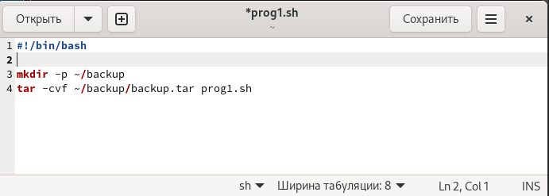
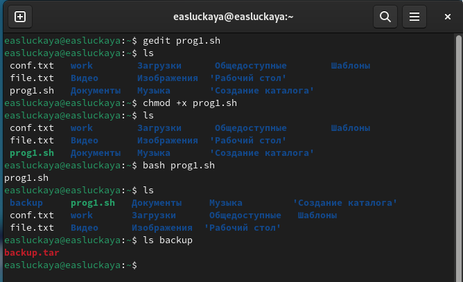
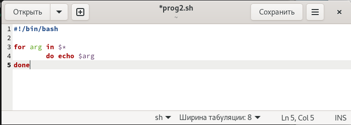
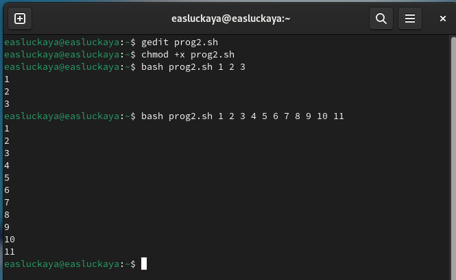
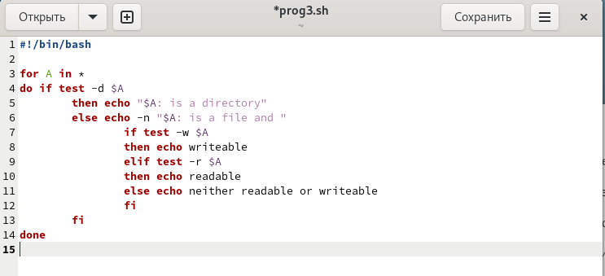
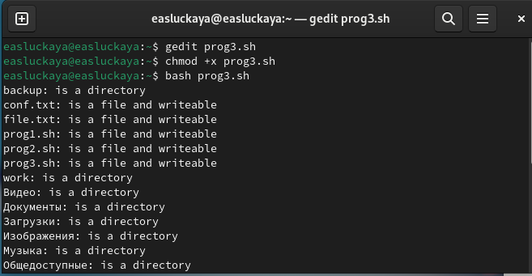
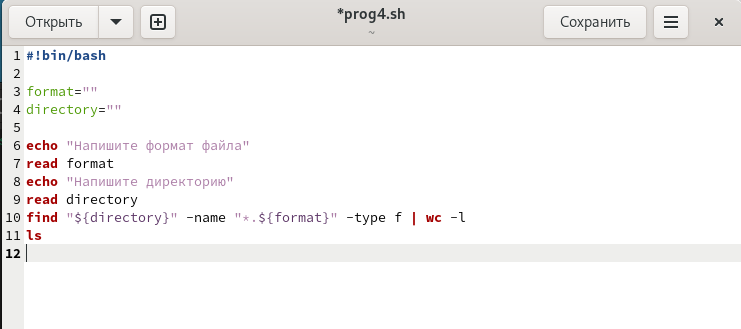
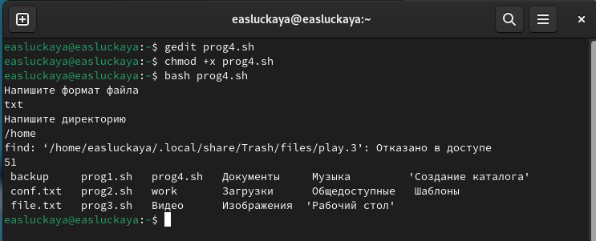

---
## Front matter
title: "Отчёта по лабораторной работе №9:"
subtitle: "Программирование в командном процессоре ОС UNIX. Командные файлы"
author: "Слуцкая Евгения Александровна"

## Generic otions
lang: ru-RU
toc-title: "Содержание"

## Bibliography
bibliography: bib/cite.bib
csl: pandoc/csl/gost-r-7-0-5-2008-numeric.csl

## Pdf output format
toc: true # Table of contents
toc-depth: 2
lof: true # List of figures
fontsize: 12pt
linestretch: 1.5
papersize: a4
documentclass: scrreprt
## I18n polyglossia
polyglossia-lang:
  name: russian
  options:
	- spelling=modern
	- babelshorthands=true
polyglossia-otherlangs:
  name: english
## I18n babel
babel-lang: russian
babel-otherlangs: english
## Fonts
mainfont: PT Serif
romanfont: PT Serif
sansfont: PT Sans
monofont: PT Mono
mainfontoptions: Ligatures=TeX
romanfontoptions: Ligatures=TeX
sansfontoptions: Ligatures=TeX,Scale=MatchLowercase
monofontoptions: Scale=MatchLowercase,Scale=0.9
## Biblatex
biblatex: true
biblio-style: "gost-numeric"
biblatexoptions:
  - parentracker=true
  - backend=biber
  - hyperref=auto
  - language=auto
  - autolang=other*
  - citestyle=gost-numeric
## Pandoc-crossref LaTeX customization
figureTitle: "Рис."
tableTitle: "Таблица"
listingTitle: "Листинг"
lofTitle: "Список иллюстраций"
lolTitle: "Листинги"
## Misc options
indent: true
header-includes:
  - \usepackage{indentfirst}
  - \usepackage{float} # keep figures where there are in the text
  - \floatplacement{figure}{H} # keep figures where there are in the text
---

# Цель работы

Изучить основы программирования в оболочке ОС UNIX/Linux. Научиться писать небольшие командные файлы.


# Задание

1. Выполните все примеры, приведённые в первой части описания лабораторной работы.

2. Выполните следующие действия, зафиксировав в отчёте по лабораторной работе используемые при этом команды и результаты их выполнения:

- Скопируйте файл /usr/include/sys/io.h в домашний каталог и назовите его equipment. Если файла io.h нет, то используйте любой другой файл в каталоге /usr/include/sys/ вместо него.

- В домашнем каталоге создайте директорию ~/ski.plases.

- Переместите файл equipment в каталог ~/ski.plases.

- Переименуйте файл ~/ski.plases/equipment в ~/ski.plases/equiplist.

- Создайте в домашнем каталоге файл abc1 и скопируйте его в каталог ~/ski.plases, назовите его equiplist2.

- Создайте каталог с именем equipment в каталоге ~/ski.plases.

- Переместите файлы ~/ski.plases/equiplist и equiplist2 в каталог ~/ski.plases/equipment.

- Создайте и переместите каталог ~/newdir в каталог ~/ski.plases и назовите его plans.

3. Определите опции команды chmod, необходимые для того, чтобы присвоить перечисленным ниже файлам выделенные права доступа, считая, что в начале таких прав нет:

- drwxr--r-- ... australia

- drwx--x--x ... play

- -r-xr--r-- ... my_os

- -rw-rw-r-- ... feathers

При необходимости создайте нужные файлы.

4. Проделайте приведённые ниже упражнения, записывая в отчёт по лабораторной работе используемые при этом команды:

- Просмотрите содержимое файла /etc/password.

- Скопируйте файл ~/feathers в файл ~/file.old.

- Переместите файл ~/file.old в каталог ~/play.

- Скопируйте каталог ~/play в каталог ~/fun.

- Переместите каталог ~/fun в каталог ~/play и назовите его games.

- Лишите владельца файла ~/feathers права на чтение.

- Что произойдёт, если вы попытаетесь просмотреть файл ~/feathers командой cat?

- Что произойдёт, если вы попытаетесь скопировать файл ~/feathers?

- Дайте владельцу файла ~/feathers право на чтение.

- Лишите владельца каталога ~/play права на выполнение.

- Перейдите в каталог ~/play. Что произошло?

- Дайте владельцу каталога ~/play право на выполнение.

5. Прочитайте man по командам mount, fsck, mkfs, kill и кратко их охарактеризуйте, приведя примеры.


# Теоретическое введение

Командный процессор (командная оболочка, интерпретатор команд shell) — это программа, позволяющая пользователю взаимодействовать с операционной системой компьютера. В операционных системах типа UNIX/Linux наиболее часто используются следующие реализации командных оболочек:
  
- оболочка Борна (Bourne shell или sh) — стандартная командная оболочка UNIX/Linux, содержащая базовый, но при этом полный набор функций;

- С-оболочка (или csh) — надстройка на оболочкой Борна, использующая С-подобный синтаксис команд с возможностью сохранения истории выполнения команд;

- оболочка Корна (или ksh) — напоминает оболочку С, но операторы управления программой совместимы с операторами оболочки Борна;

- BASH — сокращение от Bourne Again Shell (опять оболочка Борна), в основе своей совмещает свойства оболочек С и Корна (разработка компании Free Software Foundation).

POSIX (Portable Operating System Interface for Computer Environments) — набор стандартов описания интерфейсов взаимодействия операционной системы и прикладных программ. Стандарты POSIX разработаны комитетом IEEE (Institute of Electrical and Electronics Engineers) для обеспечения совместимости различных UNIX/Linux-подобных операционных систем и переносимости прикладных программ на уровне исходного кода. POSIX-совместимые оболочки разработаны на базе оболочки Корна.

# Выполнение лабораторной работы

1. Выполним все примеры, приведённые в первой части описания лабораторной работы. 

Для копирования файлов и каталогов будем использовать команду `cp [-опции] исходный_файл целевой_файл`, а для их перемещения и переименования будем использовать команду `mv [-опции] старый_файл новый_файл`:

**Копирование файла в текущем каталоге** - скопировать файл ~/abc1 в файл april и в файл may (рис. [-@fig:001]).

{#fig:001 width=100%}

**Копирование нескольких файлов в каталог** - скопировать файлы april и may в каталог monthly (рис. [-@fig:002]).

{#fig:002 width=100%}

**Копирование файлов в произвольном каталоге** - скопировать файл monthly/may в файл с именем june (рис. [-@fig:003]).
    
{#fig:003 width=100%}

**Копирование каталогов в текущем и произвольном каталогах** - скопировать каталог monthly в каталог monthly.00, скопировать каталог monthly.00 в каталог /tmp (рис. [-@fig:004]).
    
{#fig:004 width=100%}

**Переименование файлов в текущем каталоге** - изменить название файла april на july в домашнем каталоге. **Перемещение файлов в другой каталог** - переместить файл july в каталог monthly.00(рис. [-@fig:005]).

{#fig:005 width=100%}

**Переименование каталогов в текущем каталоге** - переименовать каталог monthly.00 в monthly.01. **Перемещение каталога в другой каталог** - переместить каталог monthly.01 в каталог reports. **Переименование каталога, не являющегося текущим** - переименовать каталог reports/monthly.01 в reports/monthly (рис. [-@fig:006]).
    
{#fig:006 width=100%}

Создадим файл ~/may с правом выполнения для владельца, а затем лишим владельца прав на выполнение (рис. [-@fig:007]).
    
{#fig:007 width=100%}

2. Скопируем файл /usr/include/sys/io.h в домашний каталог и назовем его equipment. Если файла io.h нет, то используем любой другой файл в каталоге /usr/include/sys/ вместо него (рис. [-@fig:008]).
    
{#fig:008 width=100%}

В домашнем каталоге создадим директорию ~/ski.plases и переместим файл equipment в новый каталог. После переименуем файл equiplist(рис. [-@fig:009]).
    
{#fig:009 width=100%}

Создадим в домашнем каталоге файл abc1 и скопируем его в каталог ~/ski.plases и назовем его equiplist2 (рис. [-@fig:010]).
    
{#fig:010 width=100%}

Создадим каталог с именем equipment в каталоге ~/ski.plases. Затем переместим файлы ~/ski.plases/equiplist и equiplist2 в каталог ~/ski.plases/equipment (рис. [-@fig:011]).

{#fig:011 width=100%}

Создадим и переместим каталог ~/newdir в каталог ~/ski.plases и назовем его plans. (рис. [-@fig:012]).
    
{#fig:012 width=100%}

3. Определим опции команды **chmod**, необходимые для того, чтобы присвоить перечисленным ниже файлам выделенные права доступа, считая, что в начале таких прав нет:
- **drwxr--r-- ... australia**: создадим новый каталог australia, проверим какие у него права, а после, в моем случае, используем `chmod g-x,o-x australia`, чтобы изменить на нужные права (рис. [-@fig:013]).

{#fig:013 width=100%}

- **drwx--x--x ... play**: делаем то же самое, но используем `chmod g-r,o-r play` (рис. [-@fig:014]).

{#fig:014 width=100%}

- **-r-xr--r-- ... my_os**: создаем в этот раз уже файл my_os и пишем команду `chmod u-w,u+x my-os` (рис. [-@fig:015]).

{#fig:015 width=100%}

- **-rw-rw-r-- ... feathers**: здесь уже используем `chmod g+w feathers` (рис. [-@fig:016]).

{#fig:016 width=100%}

4. Просмотрим содержимое файла /etc/passwd, используя команду **cat** (рис. [-@fig:017]).

{#fig:017 width=100%}

Скопируем файл ~/feathers в файл ~/file.old, а затем переместим файл ~/file.old в каталог ~/play (рис. [-@fig:018]).

{#fig:018 width=100%}

Скопируем каталог ~/play в каталог ~/fun.После переместим каталог ~/fun в каталог ~/play и назовите его games(рис. [-@fig:019]).

{#fig:019 width=100%}

Лишим владельца файла ~/feathers права на чтение, используя команду `chmod u-r feathers`. Если мы попробуем просмотреть файл ~/feathers командой cat, то нам будет отказано в доступе, то же самое произойдет, если захотим скопировать данный файл. После вернем все обратно командой `chmod u+r feathers` (рис. [-@fig:020]).

{#fig:020 width=100%}

Лишим теперь владельца каталога ~/play права на выполнение, командой `chmod u-x play`. Попробуем перейти в каталог ~/play, то нам будет отказано в доступе. Вернем владельцу каталога ~/play право на выполнение, командой `chmod u+x play` (рис. [-@fig:021]).

{#fig:021 width=100%}

Прочитаем man по командам mount, fsck, mkfs, kill:

- **mount**: команда mount используется для подключения файловых систем к каталогу в иерархии файловой системы (рис. [-@fig:022]).

{#fig:022 width=100%}

- **fsck**: команда fsck (file system check) предназначена для проверки и исправления целостности файловых систем (рис. [-@fig:023]).

{#fig:023 width=100%}

- **mkfs**: команда mkfs (make file system) используется для создания новой файловой системы на указанном устройстве (рис. [-@fig:024]).

{#fig:024 width=100%}

- **kill**: команда kill используется для отправки сигнала процессу или группе процессов, что может привести к их завершению (рис. [-@fig:025]).

{#fig:025 width=100%}

# Контрольные вопросы

1. **Объясните понятие командной оболочки. Приведите примеры командных оболочек. Чем они отличаются?**

**Командная оболочка** – это интерфейс между пользователем и операционной системой, который позволяет пользователю взаимодействовать с операционной системой путем ввода текстовых команд. Примеры командных оболочек включают Bash (Bourne Again Shell), Zsh (Z Shell), Fish (Friendly Interactive Shell) и другие. Они отличаются по своим возможностям, синтаксису, встроенным функциям и поддерживаемым расширениям.

2. **Что такое POSIX?**

**POSIX** (Portable Operating System Interface) – это семейство стандартов, разработанных для обеспечения совместимости между различными операционными системами Unix. Он определяет общие интерфейсы для программирования на языке C, командной строки и управления файлами.


3. **Как определяются переменные и массивы в языке программирования bash?**

В языке программирования bash переменные определяются путем присваивания значений их именам. Например:

- Переменные: `variable_name=value`
- Массивы: `array_name[index]=value`

4. **Каково назначение операторов let и read?**

**Оператор let** используется для выполнения арифметических выражений в bash. **Оператор read** используется для считывания значений из стандартного ввода и присваивания их переменным.

5. **Какие арифметические операции можно применять в языке программирования bash?**

В языке программирования bash можно применять стандартные арифметические операции, такие как сложение, вычитание, умножение и деление.

6. **Что означает операция (( ))?**

Операция `(( ))` в bash используется для выполнения арифметических вычислений.

7. **Какие стандартные имена переменных Вам известны?**

Некоторые стандартные имена переменных в bash:

- `HOME`: домашний каталог текущего пользователя.
- `PWD`: текущий рабочий каталог.
- `PATH`: список каталогов, в которых операционная система ищет исполняемые файлы.
- `USER`: имя текущего пользователя.

8. **Что такое метасимволы?**

**Метасимволы** – это символы, которые имеют специальное значение в контексте командной строки или шаблонов файлов. Некоторые примеры метасимволов включают `*`, `?`, `[ ]`, `{ }`, `|`, `;` и `&`.

9. **Как экранировать метасимволы?**

Для экранирования метасимволов в bash используется обратная косая черта `\`. Например, чтобы использовать символ `*` как обычный символ, его можно экранировать так: `\*`.

10. **Как создавать и запускать командные файлы?**

Для создания и запуска командных файлов в bash можно использовать текстовый редактор для создания файла с расширением `.sh`, затем присвоить ему права на выполнение с помощью команды `chmod +x filename.sh`, и, наконец, запустить файл с помощью команды `./filename.sh`.

11. **Как определяются функции в языке программирования bash?**

Функции в языке программирования bash определяются с использованием ключевого слова `function` или просто с именем функции, после чего идет блок кода. Например:

``` bash
function my_function {
    # Код функции
    } 
```

12. **Каким образом можно выяснить, является файл каталогом или обычным файлом?**

Для определения, является ли файл каталогом или обычным файлом, можно использовать команду `test`. Например:

- Проверка на каталог: `test -d filename`
- Проверка на обычный файл: `test -f filename`

13. **Каково назначение команд set, typeset и unset?**

**Команды set, typeset и unset** используются для работы с переменными в bash:

- `set`: устанавливает значения и флаги для параметров командной строки.
- `typeset`: используется для объявления переменных с определенными свойствами, такими как readonly или integer.
- `unset`: удаляет значения переменных.

14. **Как передаются параметры в командные файлы?**

Параметры передаются в командные файлы в виде аргументов командной строки. Они доступны внутри скрипта через специальные переменные `$1`, `$2`, `$3` и так далее, где `$1` содержит первый аргумент, `$2` – второй и т.д.

15. **Назовите специальные переменные языка bash и их назначение.**

Некоторые специальные переменные языка bash и их назначение:

- `$0`: имя текущей выполняемой программы.
- `$#`: количество аргументов, переданных скрипту.
- `$?`: код возврата последней выполненной команды.
- `$$`: PID (идентификатор процесса) текущего скрипта.
- `$!`: PID последнего запущенного фонового процесса.

# Выводы

В данной лабораторной работе мы изучили основы программирования в оболочке ОС UNIX/Linux, а также научились писать небольшие командные файлы.

# Список литературы{.unnumbered}

1. Руководство к лабораторной работе №9.

::: {#refs}
:::
