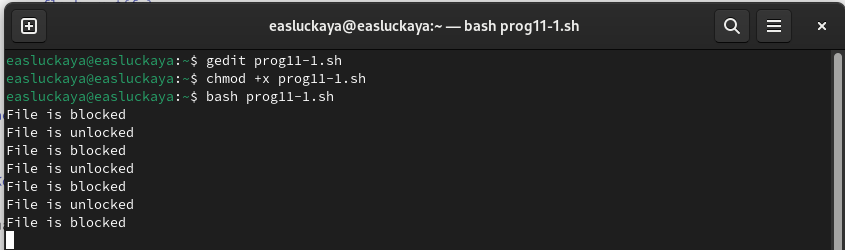

---
## Front matter
title: "Отчёта по лабораторной работе №11:"
subtitle: "Программирование в командном процессоре ОС UNIX. Расширенное программирование"
author: "Слуцкая Евгения Александровна"

## Generic otions
lang: ru-RU
toc-title: "Содержание"

## Bibliography
bibliography: bib/cite.bib
csl: pandoc/csl/gost-r-7-0-5-2008-numeric.csl

## Pdf output format
toc: true # Table of contents
toc-depth: 2
lof: true # List of figures
fontsize: 12pt
linestretch: 1.5
papersize: a4
documentclass: scrreprt
## I18n polyglossia
polyglossia-lang:
  name: russian
  options:
	- spelling=modern
	- babelshorthands=true
polyglossia-otherlangs:
  name: english
## I18n babel
babel-lang: russian
babel-otherlangs: english
## Fonts
mainfont: PT Serif
romanfont: PT Serif
sansfont: PT Sans
monofont: PT Mono
mainfontoptions: Ligatures=TeX
romanfontoptions: Ligatures=TeX
sansfontoptions: Ligatures=TeX,Scale=MatchLowercase
monofontoptions: Scale=MatchLowercase,Scale=0.9
## Biblatex
biblatex: true
biblio-style: "gost-numeric"
biblatexoptions:
  - parentracker=true
  - backend=biber
  - hyperref=auto
  - language=auto
  - autolang=other*
  - citestyle=gost-numeric
## Pandoc-crossref LaTeX customization
figureTitle: "Рис."
tableTitle: "Таблица"
listingTitle: "Листинг"
lofTitle: "Список иллюстраций"
lolTitle: "Листинги"
## Misc options
indent: true
header-includes:
  - \usepackage{indentfirst}
  - \usepackage{float} # keep figures where there are in the text
  - \floatplacement{figure}{H} # keep figures where there are in the text
---

# Цель работы

Изучить основы программирования в оболочке ОС UNIX. Научиться писать более сложные командные файлы с использованием логических управляющих конструкций и циклов.

# Задание

1. Написать командный файл, реализующий упрощённый механизм семафоров. Командный файл должен в течение некоторого времени t1 дожидаться освобождения ресурса, выдавая об этом сообщение, а дождавшись его освобождения, использовать его в течение некоторого времени t2<>t1, также выдавая информацию о том, что ресурс используется соответствующим командным файлом (процессом). Запустить командный файл в одном виртуальном терминале в фоновом режиме, перенаправив его вывод в другой (>/dev/tty#, где # — номер терминала куда перенаправляется вывод), в котором также запущен этот файл, но не фоновом, а в привилегированном режиме. Доработать программу так, чтобы имелась возможность взаимодействия трёх и более процессов.

2. Реализовать команду man с помощью командного файла. Изучите содержимое каталога /usr/share/man/man1. В нем находятся архивы текстовых файлов, содержащих справку по большинству установленных в системе программ и команд. Каждый архив можно открыть командой less сразу же просмотрев содержимое справки. Командный файл должен получать в виде аргумента командной строки название команды и в виде результата выдавать справку об этой команде или сообщение об отсутствии справки, если соответствующего файла нет в каталоге man1.

3. Используя встроенную переменную $RANDOM, напишите командный файл, генерирующий случайную последовательность букв латинского алфавита. Учтите, что $RANDOM выдаёт псевдослучайные числа в диапазоне от 0 д 32767.


# Теоретическое введение

## Переменные в языке программирования bash

Командный процессор bash обеспечивает возможность использования переменных типа строка символов. Имена переменных могут быть выбраны пользователем. Пользователь имеет возможность присвоить переменной значение некоторой строки символов.

Например, команда

```
mark=/usr/andy/bin
```

переместит файл afile из текущего каталога в каталог с абсолютным полным именем */usr/andy/bin*.
Использование значения, присвоенного некоторой переменной, называется подстановкой. Для того чтобы имя переменной не сливалось с символами, которые могут следовать за ним в командной строке, при подстановке в общем случае используется следующая форма записи:

```
${имя переменной}
```

Оболочка bash позволяет работать с массивами. Для создания массива используется команда set с флагом -A. За флагом следует имя переменной, а затем список значений, разделённых пробелами. Например,
  
```
set -A states Delaware Michigan "New Jersey"
```

## Использование арифметических вычислений. Операторы let и read

Команда let берет два операнда и присваивает их переменной. Положительным моментом команды let можно считать то, что для идентификации переменной ей не нужен знак доллара; вы можете писать команды типа let sum=x+7, и let будет искать переменную x и добавлять к ней 7.

Команда let также расширяет другие выражения let, если они заключены в двойные круглые скобки. Таким способом вы можете создавать довольно сложные выражения. Команда let не ограничена простыми арифметическими выражениями.
  
Команда read позволяет читать значения переменных со стандартного ввода:
  
```
echo "Please enter Month and Day of Birth ?"
read mon day trash
```

## Командные файлы и функции

Последовательность команд может быть помещена в текстовый файл. Такой файл называется командным. Далее этот файл можно выполнить по команде:
  
```
bash командный_файл [аргументы]
```

Чтобы не вводить каждый раз последовательности символов bash, необходимо изменить код защиты этого командного файла, обеспечив доступ к этому файлу по выполнению. Это может быть сделано с помощью команды
  
```
chmod +x имя_файла
```

# Выполнение лабораторной работы

1. Напишем командный файл, реализующий упрощённый механизм семафоров. Командный файл должен в течение некоторого времени t1 дожидаться освобождения ресурса, выдавая об этом сообщение, а дождавшись его освобождения, использовать его в течение некоторого времени t2<>t1, также выдавая информацию о том, что ресурс используется соответствующим командным файлом (процессом). Запустить командный файл в одном виртуальном терминале в фоновом режиме, перенаправив его вывод в другой (>/dev/tty#, где # — номер терминала куда перенаправляется вывод), в котором также запущен этот файл, но не фоновом, а в привилегированном режиме. Доработать программу так, чтобы имелась возможность взаимодействия трёх и более процессов. (рис. [-@fig:001]):

```bash
lockfile="./lock.file"
exec {fn}>$lockfile

while test -f "$lockfile"
do 
	if flock -n ${fn} 
	then
		echo "File is blocked"
		sleep 5
		echo "File is unlocked"
		flock -u ${fn}
	else
		echo "File is blocked"
		sleep 5
	fi 
done 
```
	
{#fig:001 width=100%}

Делаем файлы исполняемыми и выводим результат (рис. [-@fig:002]).

{#fig:002 width=100%}

2. Реализуем команду man с помощью командного файла. Изучим содержимое каталога /usr/share/man/man1 (рис. [-@fig:003]). В нем находятся архивы текстовых файлов, содержащих справку по большинству установленных в системе программ и команд. Каждый архив можно открыть командой less сразу же просмотрев содержимое справки. Командный файл получает в виде аргумента командной строки название команды и в виде результата выдаёт справку об этой команде или сообщение об отсутствии справки, если соответствующего файла нет в каталоге man1. (рис. [-@fig:004]):

{#fig:003 width=100%}

```bash
a=$1
if test -f "/usr/share/man/man1/$a.1.gz"
	then less /usr/share/man/man1/$a.1.gz
else echo "There is no such command"
fi
```

{#fig:004 width=100%}

Делаем файлы исполняемыми и проверяем работу программы, запросив справку о команде `ls` (рис. [-@fig:005]) 

{#fig:005 width=100%}

В итоге мы получаем справку команды `ls`, которую запрашивали (рис. [-@fig:006]).
    
{#fig:006 width=100%}

3. Используя встроенную переменную $RANDOM, напишем командный файл, генерирующий случайную последовательность букв латинского алфавита (рис. @fig:007). Учтём, что $RANDOM выдаёт псевдослучайные числа в диапазоне от 0 до 32767 (рис. [-@fig:007]):

```bash
a=$1
for ((i=0; i<$a; i++))
do 
	((char=$RANDOM%26+1))
	case $char in
	1) echo -n a;; 2) echo -n b;; 3) echo -n c;; 4) echo -n d;; 5) echo -n e;; 
	6) echo -n f;; 7) echo -n g;; 8) echo -n h;; 9) echo -n i;; 10) echo -n j;; 
	11) echo -n k;; 12) echo -n l;; 13) echo -n m;; 14) echo -n n;; 15) echo -n o;; 
	16) echo -n p;; 17) echo -n r;; 18) echo -n s;; 19) echo -n t;; 20) echo -n q;; 
	21) echo -n u;; 22) echo -n v;; 23) echo -n w;; 24) echo -n x;; 25) echo -n y;; 
	26) echo -n z;; 
	esac
done
echo
```
    
{#fig:007 width=100%}

Делаем файлы исполняемыми и выводим результат (рис. [-@fig:008]).
    
{#fig:008 width=100%}

# Контрольные вопросы

1. Найдите синтаксическую ошибку в следующей строке: `while [$1 != "exit"]`

В данной строчке допущены следующие ошибки: не хватает пробелов после первой скобки [ и перед второй скобкой ] выражение $1 необходимо взять в “”, потому что эта переменная может содержать пробелы. Таким образом, правильный вариант должен выглядеть так: 

```bash
while [ "$1" != "exit" ]
```

2. Как объединить (конкатенация) несколько строк в одну?

Для объединения нескольких строк в одну в bash-скриптах можно использовать следующие методы:

- Просто написать строки одну за другой без разделителей:

```bash
str="Строка1""Строка2""Строка3"
```

- Использовать оператор конкатенации (`+=`), чтобы добавить к строке дополнительные данные:

```bash
str="Строка1"
str+="Строка2"
str+="Строка3"
```

- Использовать команду `printf` для форматирования и объединения строк:

```bash
printf -v str "%s%s%s" "Строка1" "Строка2" "Строка3"
```

- Использовать команду `echo` с опцией `-n` для предотвращения добавления новой строки после каждого вызова:

```bash
str=$(echo -n "Строка1"; echo -n "Строка2"; echo -n "Строка3")
```

3. Найдите информацию об утилите seq. Какими иными способами можно реализовать её функционал при программировании на bash?

Утилита `seq` в bash используется для генерации последовательности чисел. Она позволяет указать начальное число, шаг и конечное число для создания последовательности. Например, команда `seq 1 2 10` выведет числа от 1 до 10 с шагом 2. Чтобы реализовать функционал `seq` без использования самой утилиты, можно применить следующие подходы:

- Использование цикла `for`:
```bash
for ((i=1; i<=10; i+=2)); do
    echo $i
done
```

- Использование цикла `while`:
```bash
i=1
while [ $i -le 10 ]; do
    echo $i
    i=$((i+2))
done
```

- Использование brace expansion `{}`:
```bash
echo {1..10..2}
```

4. Какой результат даст вычисление выражения $((10/3))?

Данное выражение в bash приведёт к выполнению целочисленного деления, так как bash не поддерживает вещественную арифметику в арифметических операциях. В результате, вы получите целую часть от деления 10 на 3, то есть **3**. 

5. Укажите кратко основные отличия командной оболочки zsh от bash.

Командная оболочка `zsh` часто сравнивается с `bash`, так как обе они широко используются и имеют много общего. Однако между ними есть ряд отличий:

- **Интерактивность**: `zsh` предлагает более продвинутые возможности для интерактивной работы, включая улучшенное автодополнение и коррекцию ошибок.
- **Темы и плагины**: `zsh` поддерживает темы и плагины через фреймворк `oh-my-zsh`, что позволяет легко настраивать внешний вид и функциональность оболочки.
- **Синтаксис**: В `zsh` есть улучшения синтаксиса, такие как более гибкие глобальные выражения и расширенные возможности для работы со строками и массивами.
- **Совместимость**: `zsh` обычно совместим с `bash`, но включает дополнительные функции, которые могут не работать в `bash`.
- **Конфигурация**: Файлы конфигурации для `zsh` (`~/.zshrc`) и `bash` (`~/.bashrc` и `~/.bash_profile`) различаются, и `zsh` предоставляет более обширные настройки по умолчанию.

Эти отличия делают `zsh` популярным выбором для пользователей, которые ищут более богатый пользовательский интерфейс и гибкость в настройке своей командной оболочки. Однако `bash` остаётся стандартом для многих систем и скриптов из-за его широкой доступности и предсказуемости. 

6. Проверьте, верен ли синтаксис данной конструкции `for ((a=1; a <= LIMIT; a++))`.

Синтаксис данной конструкции верен, потому что, используя двойные круглые скобки, можно не писать $ перед переменными ().

7. Сравните язык bash с какими-либо языками программирования. Какие преимущества у bash по сравнению с ними? Какие недостатки?

Сравнение `bash` с другими языками программирования можно провести по нескольким критериям:

**Преимущества bash:**

- **Специализация**: `bash` идеально подходит для автоматизации рутинных задач в Unix-подобных системах.
- **Встроенная поддержка**: Практически в каждой Unix-подобной системе есть `bash`, что делает его универсальным инструментом для системного администрирования.
- **Простота использования**: Для написания простых скриптов не требуется сложная настройка или компиляция.
- **Интеграция с системой**: `bash` обладает прямым доступом к системным вызовам и утилитам командной строки.

**Недостатки bash:**

- **Ограниченная область применения**: `bash` не подходит для сложных программных систем, где требуется высокая производительность и масштабируемость.
- **Отсутствие современных функций**: В `bash` нет многих возможностей, доступных в полноценных языках программирования, таких как объектно-ориентированное программирование.
- **Сложность**: Сложные скрипты на `bash` могут быть трудночитаемыми и поддерживаемыми из-за ограничений синтаксиса и структуры языка.

Сравнивая `bash` с языками программирования, такими как **Python** или **Java**, можно отметить, что эти языки предлагают более широкие возможности для разработки программного обеспечения, включая библиотеки для научных расчетов, машинного обучения, веб-разработки и многого другого. Однако для системного администрирования и быстрой автоматизации задач `bash` остается предпочтительным выбором из-за его простоты и тесной интеграции с операционной системой.


# Выводы

В данной лабораторной работе мы изучили основы программирования в оболочке ОС UNIX и научились писать более сложные командные файлы с использованием логических управляющих конструкций и циклов.


# Список литературы{.unnumbered}

1. Руководство к лабораторной работе №11.

::: {#refs}
:::
